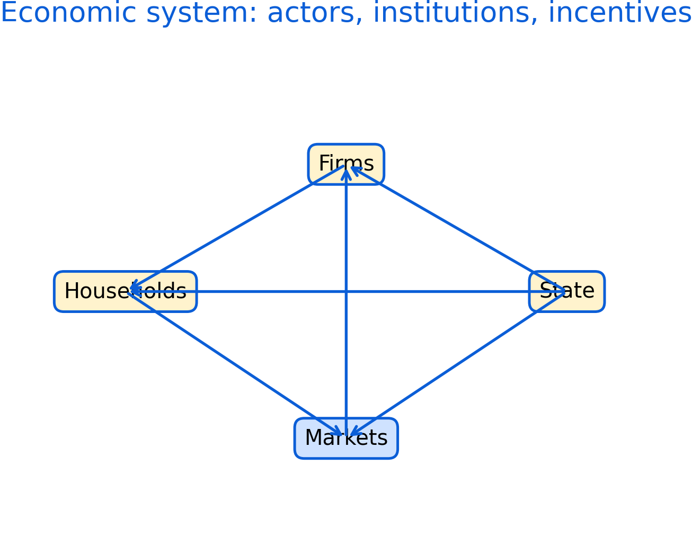

# What is Economics? {#what-is-econ}

Economics studies how people and organizations make choices under scarcity. Scarcity implies trade-offs, and those trade-offs are shaped by institutions, incentives, information, and power. This chapter builds a shared vocabulary for the rest of the book.

Roadmap

This chapter moves from definitions to values, then to economic actors and markets. It ends by connecting market structure and market failure to why policy evaluation matters.

Learning objectives

- Define scarcity, opportunity cost, and incentives.
- Explain why economic evaluation involves values such as efficiency and fairness.
- Compare broad traditions of economic thought and their information assumptions.
- Identify key actors and describe how their objectives can differ.
- Recognize common market structures and what they imply for power.


```{r fig-econ-system, echo=FALSE, fig.cap='Economic system overview showing households, firms, markets, and the state. Use this map as a guide for where policy and evidence enter the system.', out.width='95%'}

```


Figure \@ref(fig:fig-econ-system) is a high-level map. It is not a model with numbers; it is a way to organize thinking. In applied work, disagreements often come from different assumptions about which arrows are strong, which are weak, and which are constrained by institutions.

## Scarcity and opportunity cost

Scarcity means that resources (time, money, labour, land, attention, public budgets) are limited relative to what people want or need. Opportunity cost captures the idea that choosing one option usually means giving up another. In policy contexts, opportunity costs can be non-monetary, such as foregone services, worse health outcomes, or environmental degradation.

In applied analysis, opportunity cost is often the difference between a world with an intervention and a world without it. That is why counterfactual reasoning is central later in the book.

## Economics as evidence and as judgment

Economics uses data and models to explain patterns, but it also uses criteria to judge outcomes.

Efficiency is one criterion, but it comes in more than one form. Narrow efficiency focuses on maximizing outputs for given inputs. Broader efficiency can incorporate system waste, spillovers, and long-run sustainability.

Fairness, trust, freedom, and equality appear when policies affect different groups differently. In practice, many debates are really about which values are prioritized and what trade-offs are acceptable.

## Economic theories and assumptions

Different traditions emphasize different mechanisms. Social and institutional perspectives highlight that markets are embedded in social norms and legal rules. Post-Keynesian approaches emphasize uncertainty, market power, and effective demand. Neoclassical approaches often start from idealized markets and then add frictions.

These traditions differ in how they treat information. Closed-information assumptions make cost-benefit analysis easier but can omit hard-to-measure impacts. Open-information approaches encourage wider evidence but can be harder to summarize.

## Economic actors

Households, firms, the state, and community actors have different objectives. Firms may pursue profit, market share, stability, or stakeholder goals. States can pursue growth, stability, redistribution, and provision of public goods. Community actors can stabilize local systems through cooperation, mutual aid, and governance.

Households are rarely a single decision-maker. Household bargaining, risk pooling, caregiving, and division of labour can affect labour supply, consumption, and health outcomes.

## Markets and market structure

Market structure shapes prices, entry, innovation, and power. Monopoly and monopsony concentrate power on one side of the market. Oligopoly creates strategic interaction among large sellers. Monopolistic competition is common in differentiated goods and services. Perfect competition is a benchmark that helps organize reasoning, even if it is rarely fully met.

## Market failure and why it matters

Market failures include market power, information problems, externalities, public goods, and missing markets. Many health and social policy questions arise because markets do not naturally deliver equitable or efficient outcomes.

Common pitfalls

- Treating efficiency as the only objective and ignoring distribution.
- Assuming markets are competitive when market power is present.
- Using a narrow cost-benefit frame when important impacts are unmeasured.
- Forgetting that households and communities are actors, not background.

Key takeaways

- Economics is about choices under scarcity and the trade-offs those choices create.
- Values and institutions shape what is measured and what counts as success.
- Market structure is a practical way to think about power and policy needs.
