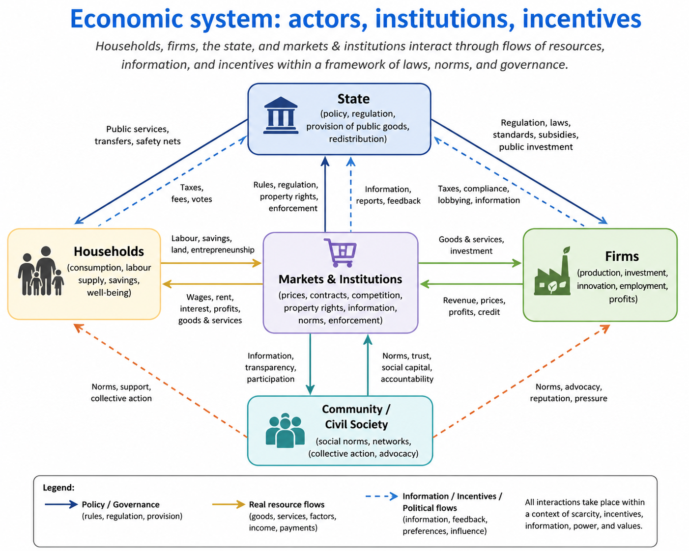

# What is Economics? {#what-is-econ}

Economics studies how individuals, organizations, and governments make choices under conditions of scarcity. Because resources are limited, every choice involves trade-offs. These trade-offs are shaped not only by prices and resources, but also by institutions, incentives, information, social norms, and power.

Economics is therefore not only about money or markets. It is also about how societies organize production, distribute resources, manage risk, and define what counts as a desirable outcome. Questions about housing affordability, healthcare access, environmental degradation, taxation, inflation, and climate policy are all economic questions because they involve competing objectives under limited resources.

For example, during a drought, water may need to be allocated among households, agriculture, ecosystems, and industry. Economics helps analyze who receives water, who bears the costs, what incentives exist, and how institutions shape the outcome.

This chapter introduces core concepts and vocabulary used throughout the rest of the book.

## Roadmap

The chapter begins with scarcity and opportunity cost, then introduces the role of incentives, values, institutions, and information in economic reasoning. It next examines economic actors and market structures before concluding with market failure and the role of policy evaluation.

## Learning objectives

By the end of this chapter, you should be able to:

- define scarcity, opportunity cost, and incentives;
- explain why economic evaluation involves both evidence and values;
- compare broad economic traditions and their assumptions;
- identify major economic actors and explain how their objectives differ; and
- explain why market failures matter in applied policy analysis.

```{r fig-econ-system, echo=FALSE, fig.cap='Economic system overview showing households, firms, markets and institutions, the state, and civil society. The diagram highlights flows of resources, incentives, information, regulation, and power within the economy.', out.width='100%', fig.align='center'}

```

Figure \@ref(fig:fig-econ-system) presents a high-level view of the economic system. The figure is not a mathematical model. Instead, it is a conceptual map showing how economic actors interact through flows of labour, goods, services, taxes, regulation, information, incentives, and social norms.

The figure also emphasizes that markets do not operate in isolation. Economic activity occurs within broader institutional systems that include laws, governance structures, political systems, and cultural norms. In applied economics, disagreements often arise because people make different assumptions about which relationships are most important, which actors hold power, and which constraints matter most.

## Scarcity, trade-offs, and opportunity cost

Scarcity means that resources are limited relative to human wants and needs. These resources include money, labour, time, land, energy, institutional capacity, public budgets, and even attention.

Because resources are limited, choices must be made. Choosing one option usually means giving up another. This forgone alternative is called the *opportunity cost*.

For example, spending public funds on transportation infrastructure may reduce the funding available for healthcare or education. Protecting environmentally sensitive land may reduce opportunities for industrial development or resource extraction. Similarly, a student who spends time studying gives up leisure time or paid employment.

Opportunity costs are not always monetary. In policy contexts, they may include environmental degradation, reduced trust, poorer health outcomes, or lost social opportunities.

In applied economic analysis, opportunity cost is often evaluated by comparing a world *with* an intervention to a world *without* it. This comparison is called a *counterfactual*, and it becomes central later in the book.

## Incentives and behaviour

Incentives influence how individuals and organizations respond to policies, prices, risks, and information. Incentives may be financial, legal, social, political, or psychological.

For example, taxes on pollution attempt to discourage environmentally harmful activities, while subsidies for renewable energy attempt to encourage cleaner forms of production. Wage levels influence labour supply decisions, and social recognition may encourage volunteering or cooperation.

Economists often study how changes in incentives alter behaviour. However, incentives do not operate independently from social systems. Behaviour is also shaped by institutions, culture, laws, information, and unequal power relationships.

## Economics as evidence and as judgment

Economics uses evidence, data, and models to explain patterns and evaluate decisions. At the same time, economics also involves judgments about what outcomes are desirable.

One common criterion is *efficiency*, although efficiency can be interpreted in different ways. A narrow interpretation focuses on maximizing outputs for a given set of inputs. Broader interpretations may include long-term sustainability, resilience, spillover effects, and system-wide impacts.

Economic evaluation also involves values such as fairness, equality, freedom, stability, and environmental sustainability. Many policy debates are ultimately disagreements about which values should receive priority and what trade-offs are considered acceptable.

For example, a policy may increase total economic output while simultaneously increasing inequality. In such cases, disagreements are often not about the evidence itself, but about how outcomes should be evaluated.

## Economic theories and assumptions

Different economic traditions emphasize different mechanisms and assumptions.

Neoclassical economics often begins with simplified models of competitive markets, rational decision-making, and price-driven coordination. These models are useful because they provide clear analytical frameworks and benchmarks for comparison. However, real-world economies frequently depart from these idealized assumptions.

Institutional and social approaches emphasize that markets are embedded within legal systems, political structures, social norms, and historical relationships. From this perspective, property rights, governance systems, trust, and power are central parts of economic analysis rather than background conditions.

Post-Keynesian approaches place greater emphasis on uncertainty, instability, financial systems, market power, and effective demand. These perspectives often argue that economies do not naturally move toward stable equilibrium and may require active policy intervention.

Economic theories also differ in how they treat information. Some approaches rely on simplified assumptions where actors possess relatively complete information and markets can be analyzed using formal models. Other approaches emphasize uncertainty, incomplete information, bounded rationality, and social complexity.

These differences matter because policy conclusions often depend heavily on assumptions about behaviour, information, and institutions.

## Economic actors

Economic systems involve multiple actors with different objectives and constraints. Figure \@ref(fig:fig-econ-system) highlights how these actors interact through flows of resources, information, incentives, regulation, and social influence.

Households supply labour, consume goods and services, save, borrow, and make decisions under uncertainty. Households are rarely a single unified decision-maker. Bargaining, caregiving responsibilities, unequal income distribution, and risk-sharing arrangements within households can affect labour supply, education, consumption, and health outcomes.

Firms produce goods and services using labour, capital, technology, and natural resources. Although profit is often important, firms may also pursue market share, long-term stability, innovation, political influence, or stakeholder objectives.

Governments influence economic activity through taxation, regulation, public services, infrastructure investment, redistribution, and legal enforcement. The state also shapes markets by defining property rights, enforcing contracts, and responding to market failures.

Community organizations, non-profit groups, Indigenous governments, cooperatives, advocacy groups, and social networks also play important economic roles. These actors can provide mutual aid, influence norms, advocate for policy change, stabilize communities, and build social trust.

## Markets and market structure

Markets coordinate exchanges between buyers and sellers. However, markets differ greatly in structure, competitiveness, and power distribution.

Perfect competition assumes many buyers and sellers, relatively complete information, and free entry and exit. It is primarily a theoretical benchmark used to organize economic reasoning, even though real-world markets rarely meet all of these conditions.

A monopoly exists when a single seller dominates a market, while a monopsony occurs when a single buyer holds substantial market power. Oligopolies involve a small number of large firms whose decisions affect one another strategically. Monopolistic competition is common in differentiated goods and services where many firms compete but products are not identical.

Market structure is not only about prices and efficiency. It is also about bargaining power, political influence, innovation, and who has control over economic outcomes.

## Market failure and why it matters

Market failures occur when markets alone do not produce socially desirable outcomes.

One common example is *externalities*, where actions impose costs or benefits on others that are not reflected in market prices. Pollution and climate change are examples of negative externalities, while vaccination programs may generate positive externalities.

Another example involves *public goods*, which are difficult to exclude people from using and are often underprovided by markets. Examples include flood protection, national defense, and some forms of public health infrastructure.

Markets may also function poorly when one side possesses more information than another. These information problems are common in healthcare, insurance, and financial systems. Concentrated market power can also reduce competition, distort prices, limit innovation, and increase inequality.

Some socially valuable goods or risks may lack functioning markets altogether. Ecosystem services, biodiversity protection, and unpaid caregiving work are examples of activities that are often difficult to measure or price adequately within conventional markets.

Many policy questions arise precisely because markets do not automatically generate equitable, efficient, or sustainable outcomes.

## Common pitfalls

A common mistake in economic analysis is treating efficiency as the only policy objective while ignoring equity and distributional impacts. Another is assuming that markets are competitive when significant market power exists. Analysts may also overlook the importance of institutions, governance systems, historical context, or unequal bargaining power.

Narrow cost-benefit frameworks can become misleading when important social or environmental impacts are difficult to measure. Similarly, treating households and communities as passive background conditions rather than active economic actors can lead to incomplete analysis.

## Key takeaways

Economics studies how societies make choices under scarcity and how those choices create trade-offs. Economic outcomes are shaped not only by prices and resources, but also by institutions, incentives, information, and power.

Markets operate within broader political, legal, and social systems, and market structure strongly influences efficiency, bargaining power, and policy outcomes. Because markets do not always produce socially desirable results, governments and institutions often intervene to address market failures and broader social objectives.