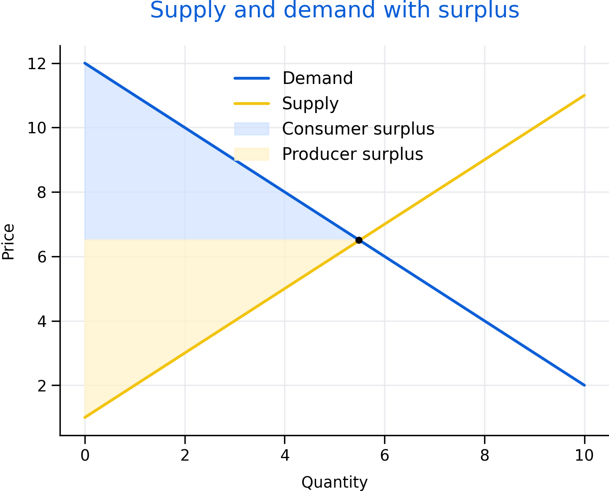

# Microeconomics Essentials {#micro}

Microeconomics explains how prices and quantities emerge, how incentives shape behaviour, and how policies change outcomes. This chapter focuses on tools that are used repeatedly in applied policy analysis.

Roadmap

We start with supply and demand, then build intuition for elasticity and incidence. We then connect market structure to market power and end with externalities and public goods as key reasons for intervention.

Learning objectives

- Use supply and demand to explain equilibrium and comparative statics.
- Interpret elasticity and connect it to behavioural response.
- Explain incidence and why burdens do not always fall where policies are applied.
- Describe market power and practical regulatory tools.
- Explain externalities and public goods and why markets may underprovide them.


```{r fig-sd-surplus, echo=FALSE, fig.cap='Supply and demand with welfare areas. The shaded regions illustrate how policies can shift not only prices and quantities but also consumer and producer surplus.', out.width='95%'}

```


Figure \@ref(fig:fig-sd-surplus) highlights why economists often talk about more than just equilibrium. Distribution of gains and losses is central for policy.

## Supply, demand, and equilibrium

Demand summarizes how quantity demanded changes with price, holding other factors constant. Supply summarizes how quantity supplied changes with price. Equilibrium is the price and quantity where supply equals demand.

Comparative statics studies how equilibrium changes when curves shift. Income, preferences, and substitutes can shift demand. Input costs, technology, and regulation can shift supply.

## Elasticity and incidence

Elasticity measures responsiveness. Price elasticity of demand is the percent change in quantity demanded for a one percent change in price. Supply elasticity is defined similarly.

Elasticity matters because it shapes incidence. When demand is relatively inelastic, consumers bear more of a tax burden. When supply is relatively inelastic, producers bear more. This is a key lesson for policy design: legal incidence and economic incidence are different.

```{r incidence-mini-sim, echo=FALSE}
# Simple illustration: steeper (inelastic) demand shifts more burden to consumers
q <- seq(0, 10, length.out = 100)
d1 <- 10 - q                 # flatter demand (more elastic)
d2 <- 10 - 0.5*q             # steeper demand (less elastic)
s  <- q

plot(q, d1, type="l", lwd=2, ylim=c(0,10), xlab="Quantity", ylab="Price",
     main="Incidence intuition: demand elasticity matters")
lines(q, d2, lwd=2, lty=2)
lines(q, s,  lwd=2)
legend("topright",
       legend=c("Demand (more elastic)", "Demand (less elastic)", "Supply"),
       lty=c(1,2,1), lwd=2)
```

## Market power in practice

Market power arises when firms or buyers can influence prices. Barriers to entry, networks, scale economies, and control over inputs all contribute.

Policy tools include antitrust, regulation, procurement design, transparency requirements, and benchmarking. In public services, market design choices (who can bid, how contracts are structured, how quality is measured) can be as important as formal regulation.

## Externalities and public goods

Externalities occur when actions impose costs or benefits on others that are not reflected in market prices. Public goods are non-rival and non-excludable. Both motivate intervention because private decisions do not reflect social costs and benefits.

Common policy approaches include taxes, subsidies, standards, tradable permits, and direct public provision. The right tool depends on measurement feasibility, enforcement, and equity goals.

Common pitfalls

- Treating elasticity as a fixed number rather than context-dependent.
- Assuming a tax always raises revenue or always reduces consumption substantially.
- Ignoring quality, access, and enforcement when discussing market interventions.
- Forgetting that market power can exist on the buyer side (monopsony).

Key takeaways

- Equilibrium is a starting point; welfare and incidence matter for policy.
- Elasticity shapes behavioural response and who bears burdens.
- Market power and externalities are central reasons for regulation.
