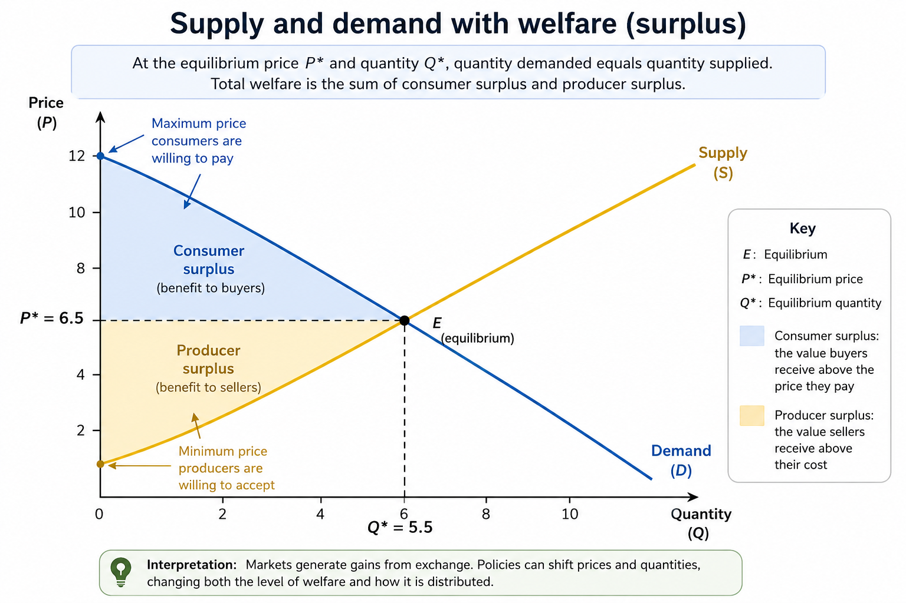

# Microeconomics Essentials {#micro}

Microeconomics studies how individuals, households, firms, and governments make decisions and interact within markets. It explains how prices and quantities emerge, how incentives shape behaviour, and how policies affect economic outcomes. Many of the tools introduced in this chapter are widely used in applied policy analysis, including healthcare, environmental regulation, labour markets, taxation, and public infrastructure planning.

For example, when governments introduce a carbon tax, regulate rental housing, subsidize public transit, or impose tariffs, economists analyze how consumers and firms respond, how prices and production change, and who ultimately bears the costs and benefits. Microeconomics provides the conceptual tools for understanding these behavioural and policy effects.

This chapter begins with supply and demand as a framework for understanding market equilibrium. It then introduces welfare, elasticity, and tax incidence before connecting market structure to market power. The chapter concludes with externalities and public goods as major reasons why governments and institutions intervene in markets.

## Learning objectives

By the end of this chapter, you should be able to:

- explain how supply and demand determine equilibrium prices and quantities;
- interpret elasticity and connect it to behavioural response;
- explain economic incidence and why policy burdens do not always fall where policies are legally applied;
- describe how market power emerges and how governments attempt to regulate it; and
- explain why externalities and public goods can lead to market failure.

```{r fig-sd-surplus, echo=FALSE, fig.cap='Supply and demand with welfare areas. Consumer surplus represents the value buyers receive above the market price, while producer surplus represents the value sellers receive above their costs. The figure highlights how policies can affect not only prices and quantities, but also the distribution of welfare.', out.width='100%', fig.align='center'}

```

Figure \@ref(fig:fig-sd-surplus) illustrates one of the most important ideas in microeconomics: markets generate gains from exchange. The equilibrium point occurs where quantity demanded equals quantity supplied. At this point, both buyers and sellers benefit from participating in the market.

The shaded areas in the figure represent *consumer surplus* and *producer surplus*. Consumer surplus measures the difference between what consumers are willing to pay and what they actually pay in the market. Producer surplus measures the difference between the market price and the minimum amount producers are willing to accept. Economists often use these concepts as simplified measures of welfare when evaluating policies and market outcomes.

Importantly, economists are often interested in more than equilibrium alone. Public policies can shift prices, quantities, and the distribution of gains and losses across groups. As a result, understanding welfare and incidence is central to applied policy analysis.

## Supply, demand, and equilibrium

Demand describes how the quantity demanded of a good or service changes with price, holding other factors constant. In general, consumers purchase more when prices are lower and less when prices are higher. Supply describes how quantity supplied changes with price. Producers are usually willing to supply more when prices increase because production becomes more profitable.

Equilibrium occurs where supply equals demand. At the equilibrium price, the quantity consumers wish to purchase matches the quantity firms wish to sell. Figure \@ref(fig:fig-sd-surplus) shows this equilibrium at point \(E\), with equilibrium price \(P^*\) and equilibrium quantity \(Q^*\).

Economists often use *comparative statics* to study how equilibrium changes when market conditions shift. Demand may shift because of changes in income, preferences, population, expectations, or the prices of related goods. Supply may shift because of changes in technology, input costs, taxes, regulation, or environmental conditions.

For example, a drought may reduce agricultural supply, increasing food prices. A subsidy for renewable energy may increase supply by lowering production costs. A rise in consumer income may increase demand for travel, housing, or recreation.

Equilibrium analysis provides a useful starting point for understanding how markets respond to change. However, equilibrium alone does not determine whether outcomes are efficient, equitable, or socially desirable.

## Elasticity, behavioural response, and incidence

Elasticity measures responsiveness. Price elasticity of demand measures the percentage change in quantity demanded resulting from a one percent change in price. Supply elasticity is defined similarly for producers.

Elasticity matters because individuals and firms do not all respond to price changes in the same way. Some goods have relatively *inelastic* demand, meaning consumers change their behaviour only slightly when prices change. Other goods have more *elastic* demand, meaning consumers respond strongly to price increases or decreases.

For example, gasoline demand is often relatively inelastic in the short run because consumers may have limited immediate alternatives. In contrast, demand for luxury goods or vacation travel is often more elastic because purchases can be delayed or substituted more easily.

Elasticity is especially important for understanding *economic incidence*, or who ultimately bears the burden of taxes and policies. The legal responsibility for paying a tax does not necessarily determine who experiences the economic burden.

When demand is relatively inelastic, consumers tend to bear a larger share of a tax because they continue purchasing even when prices rise. When supply is relatively inelastic, producers bear more of the burden because they cannot easily reduce production.

```{r incidence-mini-sim, echo=FALSE, fig.align='center'}
# Simple illustration: steeper (inelastic) demand shifts more burden to consumers
q <- seq(0, 10, length.out = 100)
d1 <- 10 - q                 # flatter demand (more elastic)
d2 <- 10 - 0.5*q             # steeper demand (less elastic)
s  <- q

plot(q, d1, type="l", lwd=2, ylim=c(0,10),
     xlab="Quantity", ylab="Price",
     main="Incidence intuition: demand elasticity matters")
lines(q, d2, lwd=2, lty=2)
lines(q, s,  lwd=2)

legend("topright",
       legend=c("Demand (more elastic)",
                "Demand (less elastic)",
                "Supply"),
       lty=c(1,2,1), lwd=2)
```

The figure above illustrates this intuition. A steeper demand curve represents more inelastic demand, meaning consumers are less responsive to price changes. In these situations, consumers generally absorb a larger share of taxes or price increases.

Elasticities are also context-dependent and may change over time. Consumers and firms often become more responsive in the long run as they adapt, discover substitutes, or change technologies.

## Market power and regulation

Perfectly competitive markets are useful analytical benchmarks, but many real-world markets contain significant concentrations of power. Market power exists when firms or buyers can influence prices, wages, output, or market conditions.

Several factors can contribute to market power, including barriers to entry, economies of scale, control over infrastructure, intellectual property, network effects, and access to information. In digital markets, large platforms may become dominant because the value of the platform increases as more users join.

Market power can exist on both the seller and buyer side of markets. Monopoly refers to a market dominated by a single seller, while monopsony refers to a market dominated by a powerful buyer, such as a major employer in a small labour market.

Governments and institutions attempt to address market power through tools such as antitrust law, regulation, procurement design, transparency requirements, price controls, and benchmarking. In public services, market design choices can strongly influence outcomes. Decisions about who can bid, how contracts are structured, and how quality is monitored may be as important as formal regulation itself.

Market structure is therefore not only about prices and efficiency. It is also about bargaining power, access, innovation, political influence, and the distribution of economic gains.

## Externalities, public goods, and market failure

Markets do not always produce socially desirable outcomes. One important reason is the existence of *externalities*, where actions impose costs or benefits on others that are not reflected in market prices.

Pollution is a common example of a negative externality because firms and consumers may not fully bear the environmental costs of their activities. Climate change is often described as one of the largest negative externalities because many environmental damages are not fully incorporated into market prices. Positive externalities can also exist. Vaccination programs, for example, create benefits for others by reducing disease transmission.

Another important source of market failure involves *public goods*. Public goods are both non-rival and non-excludable, meaning one person’s use does not substantially reduce availability to others and people cannot easily be prevented from benefiting. Examples include national defense, flood protection systems, and some forms of public health infrastructure.

Because private decisions often fail to reflect broader social costs and benefits, governments frequently intervene through taxes, subsidies, standards, tradable permits, regulation, or direct public provision. The most appropriate policy tool depends on measurement feasibility, administrative capacity, enforcement, political constraints, and equity considerations.

Understanding market failure is central to policy analysis because many public interventions are motivated by situations where markets alone do not generate efficient, equitable, or sustainable outcomes.

## Common pitfalls and key takeaways

Several common misunderstandings appear repeatedly in applied microeconomics. One is treating elasticity as a fixed number rather than something that depends on context, time horizon, and available substitutes. Another is assuming that taxes always generate large behavioural responses or substantial government revenue. Analysts may also overlook quality, enforcement, or access issues when discussing market interventions.

It is equally important to remember that market power can exist on the buyer side as well as the seller side, and that perfectly competitive markets are often theoretical benchmarks rather than realistic descriptions of actual economies.

Overall, microeconomics provides a framework for understanding how incentives shape behaviour, how markets coordinate economic activity, and why governments intervene when markets fail to achieve broader social objectives. Equilibrium analysis is an important starting point, but welfare, incidence, market power, and externalities are often what matter most in real-world policy decisions.