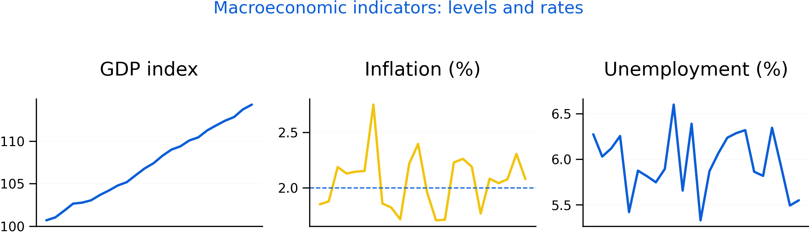

# Macroeconomics: Measurement and Trends {#macro}

Macroeconomics studies the economy as a whole. It focuses on measurement, growth, inflation, labour markets, and cycles. This chapter emphasizes what indicators mean and what they miss.

Roadmap

We introduce GDP, inflation, and unemployment measurement. We then discuss growth versus cycles and explain why distribution and inequality matter for interpreting macro indicators.

Learning objectives

- Describe what GDP measures and what it misses.
- Explain how inflation is measured and why indices can differ.
- Interpret unemployment and participation and understand limitations.
- Distinguish long-run growth from short-run business cycles.
- Explain why distribution affects macro interpretation and policy.


```{r fig-macro-dashboard, echo=FALSE, fig.cap='Illustrative dashboard of macro indicators. Multi-dimensional indicators help distinguish growth, price stability, and labour market conditions.', out.width='95%'}

```


Figure \@ref(fig:fig-macro-dashboard) is a reminder that macro conditions rarely move in one direction. Stabilization policy often manages trade-offs.

## GDP and national accounts

GDP is the value of final goods and services produced within a country over a period. It is useful as a measure of activity, but it is not a measure of welfare.

GDP can miss unpaid care work, distribution, environmental costs, and quality change. It can also rise due to rebuilding after shocks, complicating interpretation.

## Inflation and price indices

Inflation measures average price changes. The CPI is common, but results depend on the basket, substitution, quality adjustment, and treatment of housing.

Inflation is not just a statistic; it affects purchasing power, wages, and distribution. High inflation can shift resources unpredictably, while disinflation can be associated with unemployment depending on conditions.

## Unemployment, participation, and labour markets

Unemployment depends on definitions of job search and labour force participation. Participation can change due to demographics, discouragement, caregiving, and education.

Complementary measures include underemployment, long-term unemployment, and employment-to-population ratios.

## Growth and cycles

Growth reflects long-run productivity, capital accumulation, technology, and human capital. Business cycles are fluctuations around trend caused by demand shocks, supply shocks, financial conditions, and expectations.

## Distribution, poverty, and inequality

Distribution matters because aggregate indicators can hide divergent experiences across groups and regions. Poverty measures depend on thresholds and cost-of-living. Inequality can be summarized using percentiles, ratios, and indices.

Common pitfalls

- Treating GDP growth as equivalent to improved well-being.
- Interpreting inflation without considering what is driving it.
- Using unemployment alone without participation and underemployment.
- Ignoring distribution when summarizing macro performance.

Key takeaways

- Macro indicators are useful but incomplete; interpretation requires context.
- Growth and cycles have different causes and policy implications.
- Distributional analysis strengthens macroeconomic assessment.
