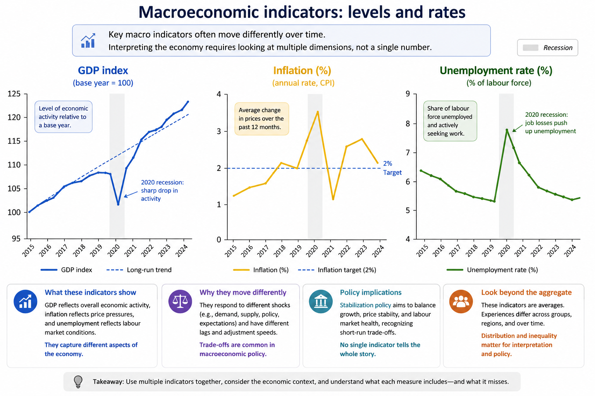

# Macroeconomics: Measurement and Trends {#macro}

Macroeconomics studies the economy as a whole. It focuses on broad economic conditions such as growth, inflation, unemployment, financial stability, and business cycles. Macroeconomics helps explain why economies expand, slow down, experience recessions, or recover from crises. It also examines how economic conditions affect households, firms, governments, and regions differently.

Unlike microeconomics, which studies individual markets and decisions, macroeconomics looks at aggregate outcomes across the economy. Policymakers use macroeconomic indicators to guide decisions about interest rates, taxation, government spending, employment policy, and social programs. However, macroeconomic indicators are imperfect measures. Understanding what they capture—and what they miss—is central to responsible economic interpretation.

This chapter introduces major macroeconomic indicators, including GDP, inflation, and unemployment, and explains how they are measured and interpreted. It then distinguishes long-run economic growth from short-run business cycles before examining why distribution and inequality matter for understanding macroeconomic performance.

## Learning objectives

By the end of this chapter, you should be able to:

- describe what GDP measures and what it does not measure;
- explain how inflation is measured and why price indices can differ;
- interpret unemployment and labour force participation measures;
- distinguish long-run economic growth from short-run business cycles; and
- explain why distribution and inequality matter for macroeconomic interpretation and policy.

```{r fig-macro-dashboard, echo=FALSE, fig.cap='Illustrative dashboard of macroeconomic indicators. GDP, inflation, and unemployment capture different dimensions of economic conditions and often move differently over time. Recession shading highlights how macroeconomic shocks affect multiple indicators simultaneously.', out.width='100%', fig.align='center'}

```

Figure \@ref(fig:fig-macro-dashboard) presents a simplified macroeconomic dashboard. The figure highlights an important principle in macroeconomics: no single indicator tells the entire story of the economy. Economic growth, inflation, and unemployment often move differently over time, creating trade-offs for policymakers and households.

The figure also illustrates that macroeconomic indicators are connected but not identical. GDP reflects overall economic activity, inflation reflects changes in prices, and unemployment reflects labour market conditions. During recessions, GDP growth may slow or decline while unemployment rises. Inflation may increase, decrease, or remain relatively stable depending on the source of the shock.

Macroeconomic interpretation therefore requires examining multiple indicators together rather than relying on a single measure.

## GDP, economic activity, and national accounts

Gross Domestic Product (GDP) measures the value of final goods and services produced within a country over a given period. GDP is widely used because it provides a broad indicator of economic activity and allows comparisons across time and countries.

Economists often distinguish between *nominal GDP* and *real GDP*. Nominal GDP is measured using current market prices, while real GDP adjusts for inflation. Real GDP is generally more useful for analyzing changes in production and living standards over time because it removes the effects of changing prices.

GDP per capita is also commonly used as a rough measure of average living standards. However, GDP and GDP per capita are not measures of overall well-being. They capture market activity, but they do not fully reflect quality of life, environmental sustainability, inequality, unpaid labour, or social conditions.

For example, unpaid caregiving and household work contribute substantially to society but are often excluded from GDP because no market transaction occurs. Similarly, environmental degradation may accompany rising GDP even when long-term ecological conditions worsen.

GDP can also become difficult to interpret after disasters or economic shocks. Rebuilding after floods, fires, or wars may increase measured economic activity even though overall welfare has declined.

As a result, GDP is best understood as a measure of economic production rather than a complete measure of social progress.

## Inflation, prices, and purchasing power

Inflation measures the average change in prices over time. The Consumer Price Index (CPI) is one of the most commonly used inflation measures and is based on the cost of a representative basket of goods and services purchased by households.

However, inflation measurement involves important methodological choices. Inflation estimates depend on the composition of the consumption basket, substitution between goods, quality adjustments, and the treatment of housing and other major expenses.

Different households may therefore experience inflation differently. For example, rising housing or food costs may affect low-income households more severely because these expenses represent a larger share of their budgets.

Inflation is not simply a statistical measure; it affects purchasing power, wages, savings, borrowing, investment decisions, and distributional outcomes. Moderate inflation is often considered manageable, but high or unstable inflation can create uncertainty and redistribute resources unpredictably across groups.

At the same time, reducing inflation too aggressively may slow economic activity and increase unemployment depending on economic conditions. Central banks therefore often attempt to balance price stability with broader macroeconomic objectives.

In Figure \@ref(fig:fig-macro-dashboard), the dashed line in the inflation panel represents a typical inflation target. Inflation fluctuates around this target over time, reflecting changing economic conditions, supply disruptions, policy responses, and expectations.

## Unemployment, participation, and labour markets

Unemployment measures the share of the labour force that is without work but actively searching for employment. Although widely used, unemployment statistics depend heavily on definitions and measurement choices.

A person who stops actively searching for work may no longer be counted as unemployed even if labour market conditions remain weak. Labour force participation can also change because of retirement, education, caregiving responsibilities, discouragement, illness, or demographic shifts.

For this reason, economists often examine several labour market indicators together rather than relying solely on the unemployment rate. Complementary measures include labour force participation, employment-to-population ratios, underemployment, long-term unemployment, and wage growth.

Figure \@ref(fig:fig-macro-dashboard) shows how unemployment tends to rise during recessions as firms reduce hiring or lay off workers. However, labour market recovery may occur more slowly than GDP recovery because firms often remain cautious about hiring after economic shocks.

Labour market conditions also differ substantially across regions, industries, education levels, age groups, and demographic categories. Aggregate unemployment rates can therefore hide important inequalities within the economy.

## Growth, business cycles, and macroeconomic fluctuations

Macroeconomists distinguish between long-run economic growth and short-run business cycles.

Long-run growth reflects increases in productive capacity over time and is influenced by factors such as technological progress, education, infrastructure, productivity, institutional quality, and capital accumulation. Sustained growth is important because it affects long-term living standards and fiscal capacity.

Business cycles, in contrast, refer to shorter-term fluctuations around long-run trends. Economies experience periods of expansion and contraction due to changes in consumer demand, investment, financial conditions, supply disruptions, expectations, and policy decisions.

Recessions are periods of declining economic activity that are often associated with falling production and rising unemployment. Recoveries occur when economic activity begins to expand again.

The shaded recession areas in Figure \@ref(fig:fig-macro-dashboard) illustrate how macroeconomic shocks can affect several indicators simultaneously. GDP growth may weaken, unemployment may rise, and inflation may behave differently depending on the source of the shock.

Understanding the distinction between growth and cycles is important because they often require different policy responses. Policies designed to stabilize short-run recessions may differ from policies aimed at improving long-run productivity and living standards.

## Distribution, poverty, and inequality

Aggregate indicators such as GDP growth or inflation averages can conceal very different experiences across households, industries, and regions. Distribution therefore plays an essential role in macroeconomic interpretation.

An economy may experience overall growth while some groups face stagnant wages, rising living costs, or declining employment opportunities. Similarly, inflation may affect households unevenly depending on their spending patterns and financial situations.

Poverty measures also depend on how thresholds are defined and how cost-of-living differences are treated across regions. Inequality can be measured using percentiles, income ratios, wealth shares, or statistical indices such as the Gini coefficient.

Distributional analysis strengthens macroeconomic assessment because it helps identify who benefits from economic growth, who bears economic risks, and how policies affect different groups.

Figure \@ref(fig:fig-macro-dashboard) reinforces this point by emphasizing that macroeconomic indicators are averages. While these measures are useful, they do not fully capture differences in lived experience across the population.

## Common pitfalls and key takeaways

One common mistake in macroeconomic analysis is treating GDP growth as equivalent to improved social well-being. Another is interpreting inflation without considering what is driving price changes or which groups are most affected. Analysts may also rely too heavily on unemployment statistics without examining labour force participation, underemployment, or wage conditions.

It is equally important to remember that macroeconomic indicators are interconnected. Policies designed to improve one outcome may influence others, creating trade-offs among growth, inflation, employment, and distribution.

Overall, macroeconomic indicators provide valuable information about economic conditions, but they require careful interpretation and context. Growth and business cycles have different causes and policy implications, and distributional analysis is essential for understanding how macroeconomic outcomes affect people differently across society.