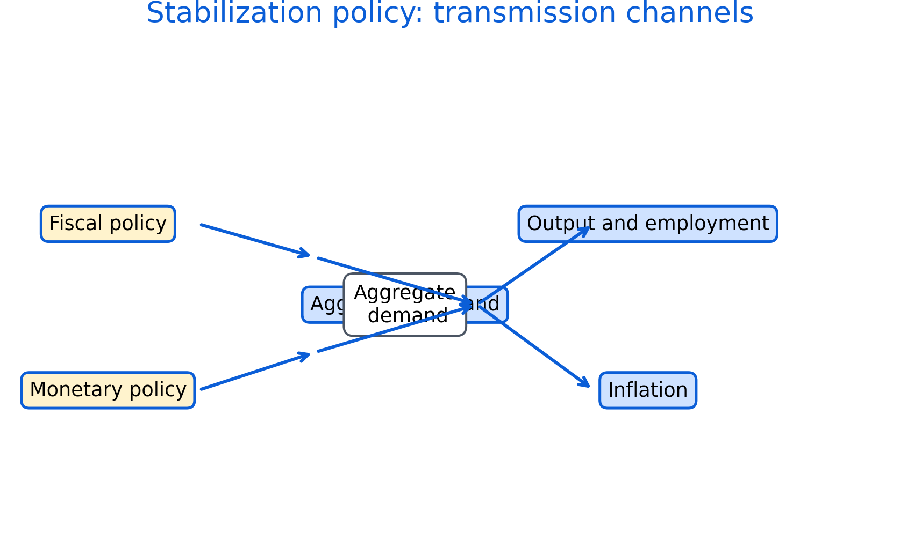

# Fiscal and Monetary Policy {#policy}

Fiscal and monetary policy are key tools for stabilization and long-run goals. Policies affect output, employment, inflation, and distribution, often with time lags and uncertainty.

Roadmap

We review fiscal instruments, then monetary policy and transmission. We close with trade-offs, credibility, and practical limits.

Learning objectives

- Describe core fiscal policy instruments and channels.
- Explain deficits and debt in relation to stabilization and sustainability.
- Describe how central banks influence interest rates and expectations.
- Explain why policy works with lags and uncertainty.
- Discuss trade-offs and distributional consequences.


```{r fig-policy-transmission, echo=FALSE, fig.cap='Transmission channels from fiscal and monetary policy to aggregate demand, output, employment, and inflation. Channels operate with lags and may differ by context.', out.width='95%'}

```


Figure \@ref(fig:fig-policy-transmission) provides a simple map of mechanisms. In practice, the strength of each channel depends on institutions, expectations, and financial conditions.

## Fiscal policy

Fiscal policy includes government spending, taxation, and transfers. Spending affects demand directly. Taxes and transfers affect disposable income and incentives.

Automatic stabilizers such as progressive taxation and unemployment insurance dampen cycles without new legislation. Discretionary policy refers to deliberate changes in spending or taxes.

Debt sustainability depends on the relationship between interest rates and growth, the credibility of fiscal institutions, and the capacity to raise revenue.

## Monetary policy

Monetary policy is conducted by central banks, often with a mandate related to inflation and economic stability. Central banks influence short-term interest rates and broader financial conditions.

Transmission channels include borrowing costs, asset prices, exchange rates, and expectations. Policy lags mean effects can arrive after conditions have changed.

Financial stability concerns can require additional tools such as macroprudential regulation.

## Practical limits and trade-offs

Policies face uncertainty, political constraints, and measurement challenges. Trade-offs include inflation control versus employment stabilization and distributional effects of interest rates and taxation.

Common pitfalls

- Treating policy effects as immediate rather than lagged.
- Ignoring distributional impacts of stabilization tools.
- Assuming one-size-fits-all transmission across countries or regions.
- Confusing short-run stabilization goals with long-run structural reforms.

Key takeaways

- Fiscal and monetary policy work through multiple channels with lags.
- Sustainability depends on context, institutions, and interest-growth dynamics.
- Good evaluation considers both effectiveness and equity.
