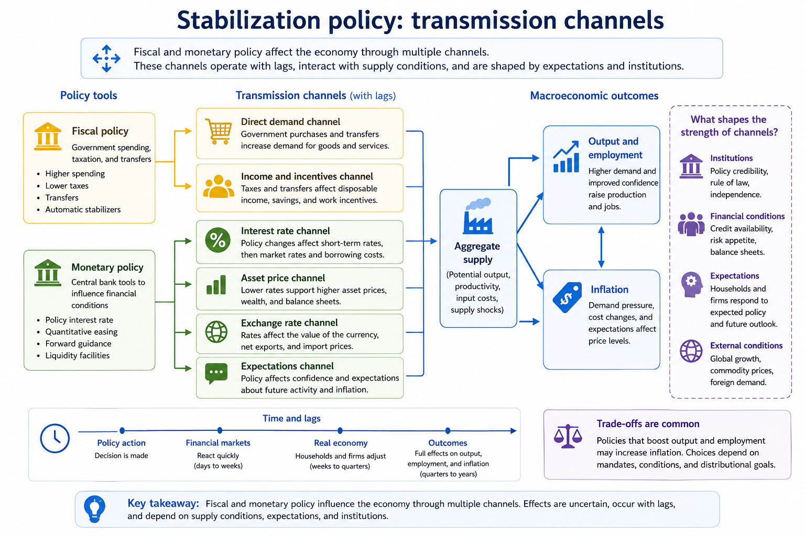

# Fiscal and Monetary Policy {#policy}

Fiscal and monetary policy are two of the most important tools governments and central banks use to stabilize the economy and support long-run economic objectives. These policies influence output, employment, inflation, borrowing conditions, investment, and distributional outcomes. However, policy effects are rarely immediate or predictable. Economic responses often occur gradually, interact with expectations and institutions, and vary across countries and economic conditions.

During recessions, governments and central banks may attempt to stimulate economic activity through higher public spending, lower taxes, or lower interest rates. During periods of high inflation, policymakers may instead attempt to slow demand growth and stabilize prices. Policymaking therefore involves balancing competing objectives under uncertainty.

This chapter examines how fiscal and monetary policy influence economic activity, inflation, and employment. It first introduces fiscal policy tools and debt dynamics, then explains monetary policy and transmission mechanisms before concluding with policy trade-offs, credibility, and practical limits.

## Learning objectives

By the end of this chapter, you should be able to:

- describe major fiscal policy instruments and their transmission channels;
- explain deficits and public debt in relation to stabilization and sustainability;
- describe how central banks influence interest rates, financial conditions, and expectations;
- explain why policy effects occur with lags and uncertainty; and
- discuss policy trade-offs and distributional consequences.

```{r fig-policy-transmission, echo=FALSE, fig.cap='Transmission channels from fiscal and monetary policy to macroeconomic outcomes. Fiscal and monetary policy influence output, employment, and inflation through multiple channels, including interest rates, expectations, income effects, and financial conditions. The strength of these channels depends on institutions, expectations, and economic conditions.', out.width='100%', fig.align='center'}

```

Figure \@ref(fig:fig-policy-transmission) illustrates how fiscal and monetary policy affect the economy through several interconnected transmission channels. Fiscal policy influences aggregate demand directly through government spending, taxation, and transfers, while monetary policy affects borrowing conditions, asset prices, exchange rates, and expectations.

The figure also emphasizes that policy effects operate with lags and depend heavily on institutions, credibility, financial conditions, and expectations. The same policy action may therefore produce different outcomes across countries, sectors, or time periods.

## Fiscal policy, deficits, and stabilization

Fiscal policy refers to government decisions regarding public spending, taxation, and transfers. Governments use fiscal policy to influence economic activity, stabilize business cycles, provide public services, and pursue long-run social and economic objectives.

Government spending affects aggregate demand directly because purchases of goods, services, and infrastructure increase economic activity. Taxation and transfers influence disposable income, consumption, savings, and work incentives.

Fiscal policy may operate automatically or through deliberate intervention. *Automatic stabilizers* are features of the fiscal system that reduce fluctuations without requiring new legislation. Progressive taxation and unemployment insurance are common examples. During recessions, tax revenues often fall while transfer payments increase automatically, partially cushioning declines in household income and demand.

*Discretionary fiscal policy*, in contrast, involves deliberate changes in taxation or spending decisions. Governments may increase infrastructure spending, provide temporary tax reductions, or introduce emergency support programs during economic downturns.

Economists often discuss fiscal policy using the idea of *fiscal multipliers*, which describe how initial changes in government spending or taxation can generate broader changes in economic activity. For example, increased government spending may raise household income, which then increases consumption and generates additional rounds of economic activity.

Fiscal policy also raises questions about deficits and public debt. Budget deficits occur when government spending exceeds revenue during a given period, while public debt reflects the accumulation of past deficits over time.

Debt sustainability depends on several factors, including economic growth, borrowing costs, institutional credibility, and the government’s ability to raise revenue. A country with strong institutions and stable growth may sustain higher debt levels more easily than a country facing financial instability or weak revenue capacity.

Importantly, debt sustainability depends not only on the size of debt, but also on the relationship between interest rates and economic growth. When economic growth exceeds borrowing costs, debt burdens may become easier to manage over time.

## Monetary policy and financial conditions

Monetary policy is typically conducted by central banks, which are often given mandates related to inflation control, employment stabilization, financial stability, or economic growth.

Central banks influence the economy primarily by affecting short-term interest rates and broader financial conditions. When central banks lower policy interest rates, borrowing costs tend to decline, encouraging consumption, investment, and lending. Higher interest rates generally have the opposite effect by discouraging borrowing and slowing demand growth.

Figure \@ref(fig:fig-policy-transmission) highlights several important monetary transmission channels. Interest rate changes affect borrowing costs for households and firms, influence asset prices such as housing and equities, alter exchange rates, and shape expectations about future economic conditions.

Expectations are especially important in modern macroeconomics. Households, firms, and financial markets respond not only to current policy, but also to what they believe policymakers will do in the future. Central bank credibility therefore plays an important role in shaping inflation expectations and financial behaviour.

In addition to conventional interest rate policy, central banks may also use *unconventional monetary policy* tools during severe downturns or financial crises. These tools can include quantitative easing, forward guidance, liquidity facilities, and large-scale asset purchases.

Monetary policy also interacts closely with financial stability. Rapid credit growth, asset bubbles, or excessive leverage may create systemic risks even when inflation appears stable. As a result, policymakers sometimes use additional tools such as macroprudential regulation, capital requirements, or lending restrictions to support financial stability.

## Transmission lags, uncertainty, and policy trade-offs

Economic policy operates with significant lags and uncertainty. Financial markets may react quickly to policy announcements, but households and firms often adjust spending, investment, and hiring decisions more gradually. The full effects of policy changes on output, employment, and inflation may take months or even years to emerge.

These lags create major challenges for policymakers because economic conditions may change before the full effects of earlier decisions become visible. Policymakers must therefore make decisions using incomplete information and uncertain forecasts.

Economic policy also involves important trade-offs. Policies designed to reduce inflation may slow economic activity and increase unemployment in the short run. Policies intended to stimulate employment and output may increase inflationary pressures or public debt.

Distributional consequences are also important. Interest rate increases may reduce inflation but increase mortgage costs for borrowers. Fiscal stimulus may support employment while distributing benefits unevenly across sectors or income groups. Tax changes may influence different households in very different ways depending on income, wealth, and consumption patterns.

Policymakers often attempt to achieve a “soft landing,” where inflation slows without causing a severe recession or sharp increases in unemployment. Achieving this balance is difficult because economies are shaped by changing expectations, supply shocks, political constraints, and global financial conditions.

The strength of policy transmission channels also differs across institutional and economic contexts. Countries with highly developed financial systems may experience stronger monetary transmission, while countries with weaker institutions or large informal sectors may respond differently to the same policy tools.

## Common pitfalls and key takeaways

Several common misunderstandings appear repeatedly in discussions of stabilization policy. One is treating policy effects as immediate rather than recognizing the importance of transmission lags. Another is assuming that fiscal and monetary policy work identically across countries or periods.

It is also important not to confuse short-run stabilization policy with long-run structural reform. Policies designed to reduce a recession may differ substantially from policies intended to improve productivity, education, infrastructure, or long-run growth.

Distributional impacts should not be ignored when evaluating stabilization policy. Policies that appear effective in aggregate terms may affect households, industries, and regions very differently.

Overall, fiscal and monetary policy influence the economy through multiple interconnected channels involving demand, expectations, financial conditions, and institutions. Their effectiveness depends not only on the policies themselves, but also on credibility, timing, economic conditions, and distributional context. Good policy evaluation therefore requires considering both effectiveness and equity rather than focusing solely on aggregate outcomes.