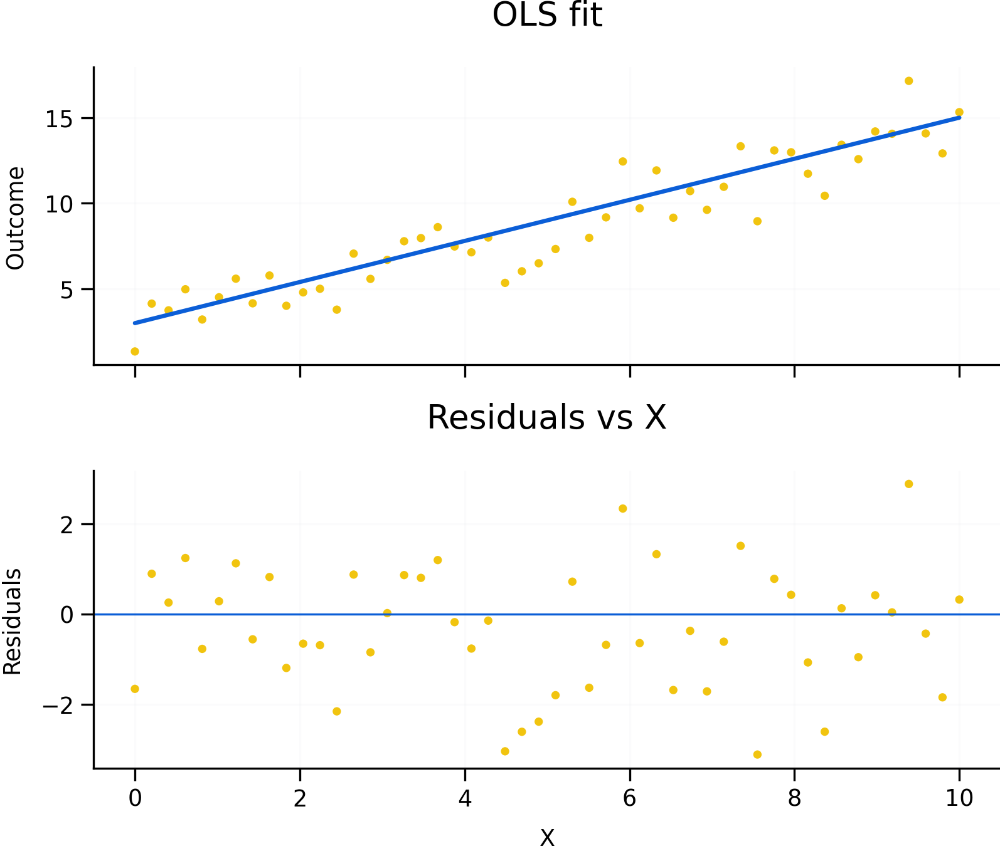

# Ordinary Least Squares (OLS): Simple Linear Regression {#ols}

OLS is a baseline method for estimating linear relationships and forming predictions. It is widely used because it is interpretable, computationally simple, and often a reasonable first approximation.

Roadmap

We explain what OLS estimates and how to interpret coefficients. We then discuss assumptions, common output statistics, and diagnostics. We end with practical responses when assumptions fail.

Learning objectives

- Interpret coefficients in a simple regression as conditional associations.
- Explain residuals and why least squares minimizes squared errors.
- Recognize key assumptions and why violations affect inference.
- Interpret common output such as R-squared, t-tests, and F-tests.
- Identify diagnostics for autocorrelation and non-constant variance.


```{r fig-ols-resid, echo=FALSE, fig.cap='OLS fit and residual diagnostics. A good fit does not guarantee valid inference; residual patterns can indicate missing variables, non-linearity, or time-series dependence.', out.width='95%'}

```


Figure \@ref(fig:fig-ols-resid) highlights a key lesson: interpretation depends on both the relationship and the leftover structure in residuals.

The code below shows what a baseline OLS workflow looks like in practice. It is a template (not meant to run as-is) and uses robust standard errors to reflect common real‑world data issues. 

```{r ols-template-robust, eval=FALSE}

# Example data (simulated) — replace this block with your real series when available
set.seed(1)
y <- 100 + cumsum(rnorm(60, 0, 2)) + 10*sin(2*pi*(1:60)/12)  # trend + seasonality

# Example data (simulated) — replace with your real dataset
set.seed(1)
df <- data.frame(
  outcome = rnorm(100),
  exposure = rbinom(100, 1, 0.5),
  age = sample(18:90, 100, TRUE),
  sex = sample(c("F","M"), 100, TRUE)
)

# Template: OLS as a baseline model (replace df/outcome/exposure with your variables)
fit <- lm(outcome ~ exposure + age + sex, data = df)
summary(fit)

# If heteroskedasticity is plausible, use robust standard errors

# Optional: robust standard errors
# install.packages(c("sandwich", "lmtest")) #if not already installed
library(sandwich)
library(lmtest)


coeftest(fit, vcov. = vcovHC(fit, type = "HC1"))
```

## What OLS estimates

In a simple linear regression, the coefficient summarizes average change in the outcome when the predictor changes by one unit, holding other modeled factors fixed.

OLS chooses coefficients to minimize the sum of squared residuals. Residuals capture what the model does not explain.

## Assumptions and why they matter

Homoskedasticity implies constant error variance. When variance changes, standard errors can be wrong.

Zero conditional mean is the core assumption for causal interpretation. Violations often reflect omitted variables, simultaneity, or measurement error.

Independence matters for cross-sectional sampling. In time series, serial correlation is common and must be addressed.

## Reading output

R-squared describes the share of variation explained. It does not measure causal validity.

t-tests evaluate whether a coefficient differs from zero given estimated uncertainty. The F-test evaluates joint significance.

AIC and BIC support model comparison by penalizing complexity.

## Diagnostics and practical fixes

When assumptions fail, options include robust standard errors, adding relevant controls, transforming variables, or using models suited to the data structure.

Common pitfalls

- Interpreting coefficients causally without an identification strategy.
- Using R-squared as a measure of truth rather than fit.
- Ignoring heteroskedasticity and serial correlation in inference.
- Overfitting with many predictors and then over-interpreting significance.

Key takeaways

- OLS is useful but inference depends on assumptions.
- Diagnostics should guide whether corrections or alternative models are needed.
- Causal claims require design, not just regression.
