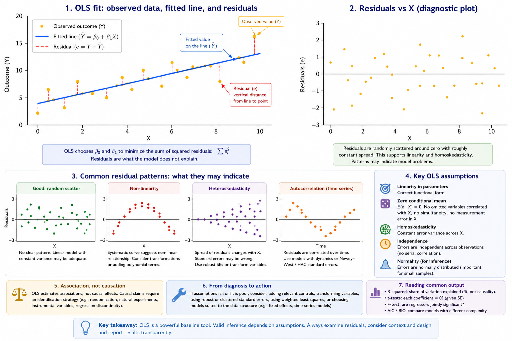

# Ordinary Least Squares (OLS): Simple Linear Regression {#ols}

Ordinary Least Squares (OLS) regression is one of the most widely used statistical tools for studying relationships between variables. Researchers use OLS to estimate associations, make predictions, and summarize patterns in data. OLS is popular because it is relatively simple to interpret, computationally efficient, and often provides a useful baseline model before moving to more advanced methods.

In economics, public policy, environmental science, healthcare, and social research, regression models are frequently used to estimate how outcomes change with exposure to different factors. For example, researchers may study how income changes with education, how pollution affects health outcomes, or how policy interventions relate to employment or spending behaviour.

However, regression models must be interpreted carefully. A model may fit the data reasonably well while still producing misleading inference if important assumptions fail. Understanding residuals, diagnostics, assumptions, and model limitations is therefore as important as interpreting coefficients themselves.

This chapter explains what OLS estimates, how coefficients and residuals should be interpreted, why assumptions matter, and how diagnostics help identify potential model problems. It also emphasizes a critical principle in applied statistics: regression alone does not establish causation.

## Learning objectives

By the end of this chapter, you should be able to:

- interpret regression coefficients as conditional associations;
- explain residuals and why OLS minimizes squared errors;
- recognize major OLS assumptions and why violations matter;
- interpret common regression output statistics; and
- identify basic diagnostic patterns and practical responses when assumptions fail.

```{r fig-ols-resid, echo=FALSE, fig.cap='OLS fit, residual intuition, and diagnostic patterns. Residuals represent the difference between observed and predicted values. Random residual patterns support the use of a linear model, while systematic patterns may indicate non-linearity, heteroskedasticity, omitted variables, or serial correlation.', out.width='100%', fig.align='center'}

```

Figure \@ref(fig:fig-ols-resid) illustrates several core ideas behind OLS regression. The upper-left panel shows observed data points together with the fitted regression line. The vertical distance between an observed value and the fitted line is called the *residual*. Residuals represent the portion of the outcome that the model does not explain.

OLS chooses the regression line that minimizes the sum of squared residuals. Squaring residuals ensures that positive and negative errors do not cancel each other out and places greater weight on larger errors.

The residual diagnostic plots in Figure \@ref(fig:fig-ols-resid) are equally important. Regression interpretation depends not only on the fitted relationship itself, but also on the remaining structure in the residuals. Random residual scatter around zero generally supports the use of a linear model with approximately constant variance. Systematic residual patterns, however, may indicate problems such as non-linearity, heteroskedasticity, omitted variables, or serial correlation.

## What OLS estimates

In a simple linear regression, the estimated coefficient summarizes the average change in the outcome associated with a one-unit change in the predictor variable.

In multiple regression models, coefficients are interpreted as *conditional associations*. This means the coefficient describes how the outcome changes with one variable while holding the other included variables constant.

For example, in a regression of wages on education and experience, the education coefficient estimates the association between education and wages conditional on the level of experience included in the model.

It is important to recognize that regression estimates associations, not necessarily causal effects. Two variables may move together because one causes the other, because both are influenced by a third factor, or because of reverse causality.

For example, ice cream sales and drowning incidents may both increase during summer months. A regression may detect a positive association even though ice cream consumption does not cause drowning. Temperature acts as a confounding factor influencing both variables simultaneously.

Because of this, causal interpretation requires careful research design rather than regression alone.

## Residuals, assumptions, and inference

Residuals play a central role in regression analysis because they help evaluate whether model assumptions appear reasonable.

One important assumption is *linearity*, meaning the relationship between predictors and the outcome is reasonably approximated by a linear function. Curved residual patterns may suggest that transformations or non-linear terms are needed.

Another important assumption is *homoskedasticity*, which means the variance of residuals remains relatively constant across levels of the predictor variables. When residual spread changes systematically, a problem called *heteroskedasticity* occurs. Heteroskedasticity does not necessarily bias coefficient estimates, but it can produce incorrect standard errors and misleading statistical inference.

Figure \@ref(fig:fig-ols-resid) includes an example of heteroskedasticity where residual variance changes across the range of observations.

A particularly important assumption for causal interpretation is the *zero conditional mean assumption*. Informally, this means that omitted factors affecting the outcome should not be systematically correlated with included predictors. Violations often arise because of omitted variables, simultaneity, measurement error, or selection bias.

For example, if ability influences both education and income but is omitted from the regression, the estimated education coefficient may partially capture the effect of ability rather than education alone.

Independence of errors is another important assumption. In cross-sectional data, observations are often assumed to be independent. In time-series data, however, residuals are frequently correlated over time. This problem, known as *serial correlation* or *autocorrelation*, can distort inference if ignored.

The residual examples in Figure \@ref(fig:fig-ols-resid) show how systematic patterns may reveal these types of problems.

## Reading regression output

Regression software typically reports several statistics that summarize model fit and uncertainty.

One commonly reported statistic is *R-squared*, which measures the proportion of variation in the outcome explained by the model. A higher R-squared indicates better statistical fit, but it does not guarantee that the model is theoretically meaningful or causally valid.

A model may fit the observed data well while still omitting important variables or using an incorrect functional form.

Regression output also reports *standard errors*, *t-tests*, and *p-values*, which help evaluate statistical uncertainty around coefficient estimates. A t-test evaluates whether a coefficient differs significantly from zero given estimated uncertainty.

The *F-test* evaluates whether groups of variables are jointly important in explaining the outcome.

When comparing models, researchers may also use criteria such as AIC and BIC, which balance model fit against model complexity. These measures discourage excessive overfitting by penalizing models that include too many predictors relative to the information gained.

## Diagnostics and practical responses

Diagnostics help determine whether a regression model appears appropriate for the data structure and research question.

Figure \@ref(fig:fig-ols-resid) illustrates several common residual patterns. Random scatter around zero generally supports the use of a linear specification with approximately constant variance. Curved residual patterns may indicate non-linearity, funnel-shaped patterns may suggest heteroskedasticity, and systematic time patterns may indicate autocorrelation.

When assumptions appear violated, researchers often modify the model or adjust inference methods. Common responses include:

- adding relevant control variables;
- transforming variables using logarithms or polynomial terms;
- using robust standard errors;
- using clustered or heteroskedasticity-consistent standard errors;
- or choosing models better suited to the data structure, such as time-series or panel-data methods.

Robust standard errors are especially common in applied work because real-world data frequently violate constant variance assumptions.

The example below shows a simplified OLS workflow using robust standard errors.

```{r ols-template-robust, eval=FALSE, echo=TRUE}
# Example data (simulated)
set.seed(1)

df <- data.frame(
  outcome = rnorm(100),
  exposure = rbinom(100, 1, 0.5),
  age = sample(18:90, 100, TRUE),
  sex = sample(c("F","M"), 100, TRUE)
)

# Baseline OLS model
fit <- lm(outcome ~ exposure + age + sex, data = df)

# Standard regression output
summary(fit)

# Robust standard errors
library(sandwich)
library(lmtest)

coeftest(fit, vcov. = vcovHC(fit, type = "HC1"))
```

This workflow reflects a common applied approach where OLS provides a baseline model and robust standard errors help account for possible heteroskedasticity.

## Common pitfalls and key takeaways

Several common misunderstandings appear frequently in regression analysis. One is interpreting regression coefficients causally without an appropriate identification strategy or research design. Another is treating R-squared as a measure of truth rather than simply a measure of fit.

Researchers may also ignore heteroskedasticity or serial correlation, leading to incorrect inference even when coefficient estimates themselves appear reasonable. Overfitting is another common problem, particularly when many predictors are included without theoretical justification.

Overall, OLS regression is a powerful and widely used baseline method for analyzing relationships between variables. However, valid inference depends on assumptions, diagnostics, and research design rather than on regression output alone. Residual analysis and model diagnostics should therefore be treated as central parts of statistical interpretation rather than optional afterthoughts.

Most importantly, causal claims require careful design, theory, and identification strategies—not regression alone.