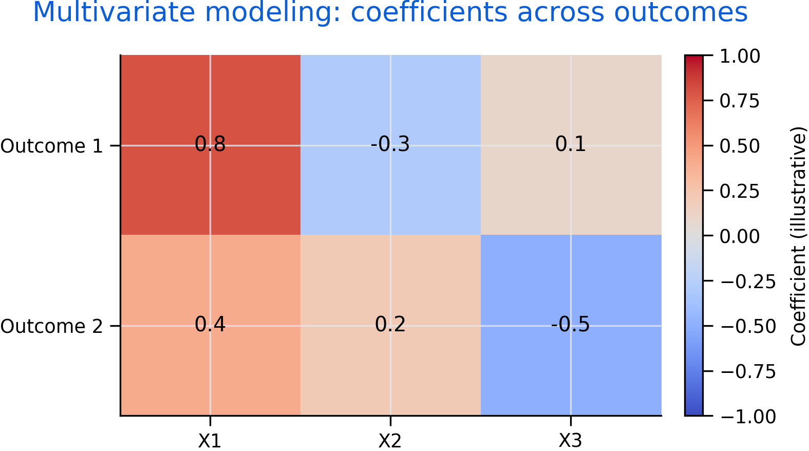

# Multivariate Modeling {#multivariate}

Applied questions often involve multiple predictors and sometimes multiple outcomes. Multivariate modeling generalizes regression thinking and raises important inference issues such as multiple testing and joint interpretation.

Roadmap

We clarify terminology, then discuss interpretation when many predictors or outcomes are present. We close with practical guidance on specification and communication.

Learning objectives

- Distinguish multiple regression from multivariate multiple regression.
- Explain why joint inference matters when outcomes are multiple.
- Describe the role of controls and interaction terms.
- Recognize risks of multiple comparisons and overfitting.
- Communicate multivariate results clearly for policy audiences.


```{r fig-multi-coef, echo=FALSE, fig.cap='Illustrative coefficient map across outcomes. The same predictor can relate differently to different outcomes, motivating joint interpretation and careful reporting.', out.width='95%'}

```


Figure \@ref(fig:fig-multi-coef) illustrates why multivariate work requires careful interpretation. Differences across outcomes can reflect mechanisms, measurement, or specification choices.

## Multiple regression

Multiple regression uses multiple predictors to explain one outcome. Controls can reduce confounding when they capture relevant omitted factors.

However, controls can also introduce bias if they are affected by the treatment (post-treatment variables). In evaluation contexts, the causal graph matters.

## Multivariate multiple regression

Multivariate multiple regression models multiple outcomes using the same predictors. It is useful when outcomes are related and when you want a coherent story across measures.

## Inference with many outcomes

Testing many outcomes increases false positives. Strategies include focusing on primary outcomes, using joint tests, and applying corrections.

## Practical reporting

Good reporting states:

- which outcomes were primary
- how multiple testing was handled
- whether results are robust across specifications
- how effects translate into meaningful units

Common pitfalls

- Treating a long list of significant results as strong evidence without correction.
- Using controls mechanically without considering causal structure.
- Reporting only significant outcomes and omitting the full set.

Key takeaways

- Multivariate models can strengthen evidence when designed carefully.
- Joint inference and transparent reporting prevent misleading conclusions.
