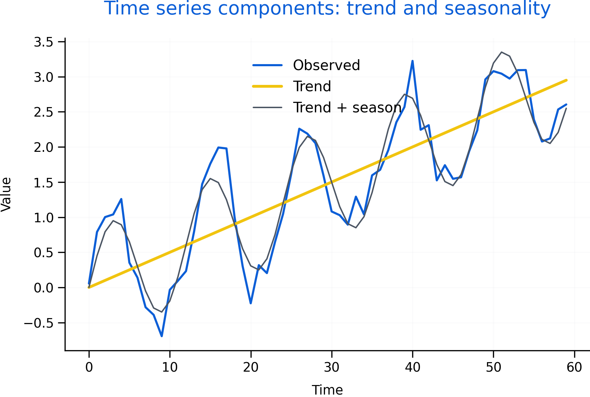

# Time Series Forecasting Theory (AR, MA, ARMA, ARIMA) {#time-series}

Time series data record values over time. Forecasting requires understanding persistence, trend, seasonality, and whether the series is stable. Many economic series are non-stationary, so transformations are often needed.

Roadmap

We introduce time series components, define stationarity, and explain AR and MA intuition. We then describe ARIMA notation and a practical Box-Jenkins workflow.

Learning objectives

- Identify trend, seasonality, cycles, and noise in a series.
- Explain stationarity and why differencing can help.
- Describe AR and MA intuition and how ACF/PACF guide orders.
- Explain ARIMA(p,d,q) and seasonal extensions.
- Outline a workflow for building and diagnosing forecasting models.


```{r fig-ts-components, echo=FALSE, fig.cap='Observed time series decomposed into trend and seasonality (illustrative). Decomposition supports model selection and clarifies why differencing or seasonal adjustment may be needed.', out.width='95%'}

```


Figure \@ref(fig:fig-ts-components) shows that a series can have structure beyond random noise. Forecasting aims to model that structure without overfitting it.

## Components and visualization

Trend is a long-run movement. Seasonality repeats at fixed intervals. Cycles are longer fluctuations that may not repeat regularly. Noise is unpredictable variation.

Visualization is the first diagnostic step. A series that looks like white noise is not forecastable beyond its mean.

## Stationarity and differencing

Stationarity means statistical properties do not change over time. Many economic series have trends, changing variance, or evolving autocorrelation.

Differencing removes trends and can help achieve stationarity. Seasonal differencing can remove repeating patterns.

## AR, MA, and ARIMA intuition

AR models use past values. MA models use past shocks. ARMA combines both. ARIMA adds differencing when the original series is non-stationary.

ACF and PACF help propose orders. Information criteria help compare models. Residual checks test whether structure remains.

Common pitfalls

- Fitting ARIMA to non-stationary data without differencing.
- Choosing high orders that fit noise rather than signal.
- Ignoring seasonality when it is visually present.
- Treating forecasts as certainty rather than probabilistic ranges.

Key takeaways

- Stationarity is central for many time-series models.
- ACF/PACF, information criteria, and residual checks form a practical workflow.
- Forecasts should be evaluated for plausibility and uncertainty.
