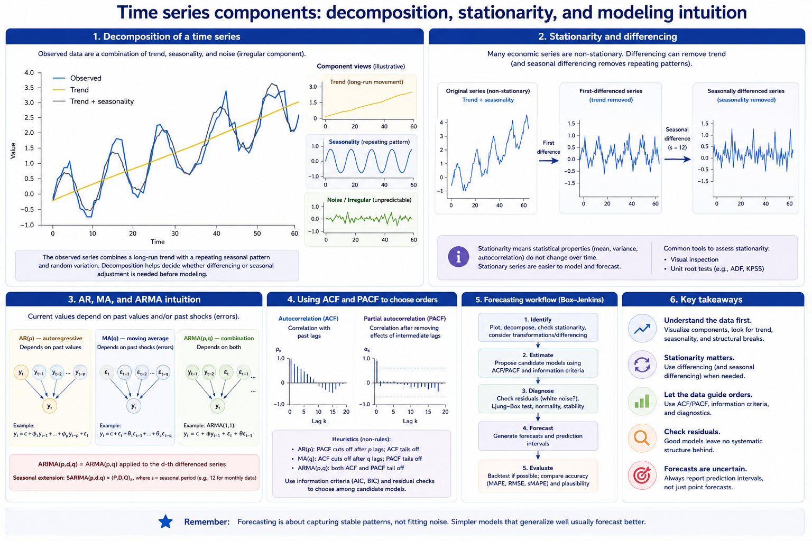

# Time Series Forecasting Theory (AR, MA, ARMA, ARIMA) {#time-series}

Time series data record observations sequentially through time. Unlike cross-sectional data, where observations are often treated as independent, time series observations are usually connected to past values and past shocks. Forecasting therefore requires understanding how patterns evolve over time and whether those patterns are stable enough to support prediction.

Economic, environmental, financial, and public health data frequently exhibit trends, cycles, persistence, and seasonal behaviour. Monthly unemployment rates, annual GDP, river discharge, inflation, electricity demand, and disease incidence are all examples of time series data.

Forecasting models attempt to capture systematic structure while avoiding overfitting random fluctuations. Good forecasting therefore depends not only on model selection, but also on understanding the underlying behaviour of the series itself.

This chapter introduces the main components of time series data, explains the idea of stationarity, develops intuition for autoregressive and moving-average models, and concludes with the logic of ARIMA forecasting and practical diagnostic workflows.

## Learning objectives

By the end of this chapter, you should be able to:

- identify trend, seasonality, cycles, and noise in a time series;
- explain stationarity and why differencing may be necessary;
- describe the intuition behind AR and MA processes;
- interpret ARIMA notation and seasonal extensions; and
- outline a practical forecasting workflow using diagnostics and residual checks.

```{r fig-ts-components, echo=FALSE, fig.cap='Illustrative decomposition of a time series into trend and seasonal components. The observed series combines long-run growth, repeating seasonal fluctuations, and random variation. Decomposition helps identify structure and supports decisions about differencing, seasonal adjustment, and model selection.', out.width='100%', fig.align='center'}

```

Figure \@ref(fig:fig-ts-components) illustrates one of the central ideas in forecasting: observed time series often contain multiple overlapping components rather than pure randomness. The blue line represents the observed data, while the trend and seasonal components help explain systematic movement over time.

The upward-sloping trend in Figure \@ref(fig:fig-ts-components) reflects long-run growth, while the repeating oscillations represent seasonality. Forecasting models attempt to capture these predictable structures without fitting random noise too aggressively.

## Components of time series data

Time series data are often described as combinations of several components.

A *trend* represents long-run movement in the series. Economic growth, population increase, technological progress, and climate warming are examples of trend behaviour.

*Seasonality* refers to patterns that repeat at regular intervals such as months, quarters, or days of the week. Retail sales often increase during holidays, electricity demand may rise during winter or summer months, and tourism activity frequently follows seasonal cycles.

*Cycles* are longer-term fluctuations that do not necessarily repeat at fixed intervals. Business cycles are a common example. Unlike seasonality, cyclical behaviour may vary substantially in duration and magnitude.

The remaining variation is often described as *noise* or *irregular variation*. This component represents unpredictable shocks and random fluctuations that forecasting models may not explain well.

Visualization is one of the most important first steps in time-series analysis. Plotting the series often reveals trends, structural breaks, changing variance, or seasonality before formal modeling begins.

A series that resembles pure white noise contains little predictable structure and is difficult to forecast beyond its historical average.

## Stationarity and differencing

Many time-series methods assume that the statistical properties of the series remain relatively stable over time. This property is known as *stationarity*.

Informally, a stationary series has a stable mean, stable variance, and stable autocorrelation structure through time. In contrast, many real-world economic and environmental series exhibit trends, changing variance, or evolving dependence structures.

Non-stationary data can create misleading statistical relationships and unstable forecasts. For this reason, transforming the series is often necessary before fitting forecasting models.

One common transformation is *differencing*, which removes long-run trend behaviour by analyzing changes between consecutive observations rather than the original levels themselves.

For example, instead of modeling GDP directly, analysts may model changes in GDP from one period to the next.

Seasonal differencing can also remove repeating seasonal patterns by subtracting observations from previous seasonal periods.

Figure \@ref(fig:fig-ts-components) illustrates why differencing may be useful. The upward trend and recurring seasonal fluctuations suggest that the original series may not satisfy stationarity assumptions in its raw form.

The following template illustrates a simple workflow for visually checking stationarity and applying differencing.

```{r ts-stationarity-template, eval=FALSE, echo=TRUE}
# Example time series object
y_ts <- ts(y, frequency = 12)

# Plot original series
plot(y_ts, main = "Time series (raw)")

# First differencing
dy <- diff(y_ts)

# Plot differenced series
plot(dy, main = "First difference")

# Optional formal stationarity test
library(tseries)

adf.test(y_ts)
adf.test(na.omit(dy))
```

Visual inspection remains important even when formal tests are used. Statistical tests may have limited power in small samples or produce conflicting conclusions when structural breaks or seasonal patterns are present.

## AR, MA, and ARIMA intuition

Many forecasting models are built around the idea that current values depend on past values and past shocks.

An *autoregressive* (AR) model assumes that the current value depends on previous observations in the series itself. For example, unemployment this month may depend partly on unemployment last month.

A *moving-average* (MA) model instead assumes that current values depend on past shocks or forecast errors. In this framework, temporary disturbances can continue to influence the series for several periods.

An *ARMA* model combines both autoregressive and moving-average behaviour. These models are useful when the series is already stationary.

Many real-world series, however, are non-stationary. *ARIMA* models extend ARMA models by adding differencing to remove trend behaviour before modeling the remaining structure.

The notation ARIMA\((p,d,q)\) summarizes the model structure:

- \(p\) represents the autoregressive order;
- \(d\) represents the degree of differencing; and
- \(q\) represents the moving-average order.

Seasonal extensions such as SARIMA models add additional seasonal autoregressive, differencing, and moving-average components.

Autocorrelation diagnostics help guide model selection. The *autocorrelation function* (ACF) measures correlation between observations separated by different time lags, while the *partial autocorrelation function* (PACF) measures correlation after controlling for intermediate lags.

Analysts often examine ACF and PACF plots together with information criteria such as AIC and BIC to propose candidate model orders.

## Forecasting workflow and diagnostics

Time-series forecasting is typically an iterative process rather than a single modeling step.

A common workflow begins with visualization and decomposition to identify trend, seasonality, structural breaks, and unusual observations. The series may then be transformed or differenced to improve stationarity.

After selecting candidate models, analysts estimate parameters and evaluate residual diagnostics. Good forecasting models should leave residuals that resemble white noise, meaning that little systematic structure remains unexplained.

Residual autocorrelation, changing variance, or remaining seasonality may indicate that the model is incomplete or misspecified.

Forecast evaluation should also consider plausibility and uncertainty rather than focusing only on point forecasts. Forecast intervals are often more informative than single predicted values because uncertainty generally increases further into the future.

Overfitting is another important concern. Highly complex models may fit historical data extremely well while performing poorly on future observations. Forecasting therefore requires balancing flexibility with generalization.

Several common pitfalls appear repeatedly in applied forecasting work. Analysts may fit ARIMA models to clearly non-stationary data without differencing, ignore visible seasonality, or select excessively high model orders that fit noise rather than meaningful structure.

It is also important not to treat forecasts as certainty. Forecasts are probabilistic statements shaped by assumptions, historical patterns, and model limitations.

Overall, time-series forecasting combines statistical modeling with careful diagnostic reasoning. Trend, seasonality, persistence, and shocks all shape how time series evolve over time. Effective forecasting therefore depends not only on choosing a model, but also on understanding the structure and stability of the underlying process.