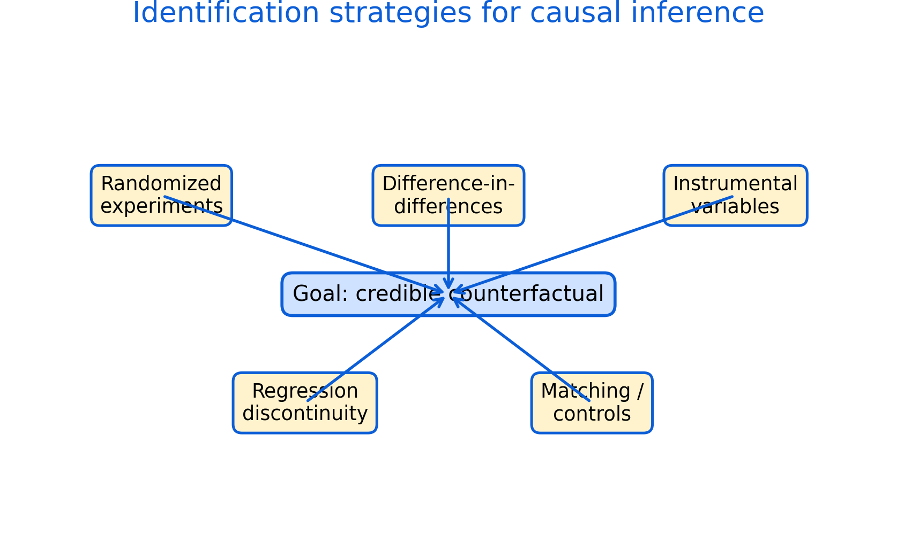

# Causality, Identification, and Policy Evaluation {#causality}

Policy analysis often asks causal questions: what is the effect of a policy, program, or exposure on an outcome? Answering this requires a credible counterfactual.

Roadmap

We explain why correlation is not causation, then outline common identification strategies and a checklist for evaluating evidence.

Learning objectives

- Define counterfactual reasoning and why it is central.
- Identify major threats to causal interpretation.
- Describe common identification strategies and when they are plausible.
- Use a checklist to assess credibility and robustness.


```{r fig-identification, echo=FALSE, fig.cap='Identification strategies for causal inference. Different designs create different approximations to the counterfactual; credibility depends on assumptions and context.', out.width='95%'}

```


Figure \@ref(fig:fig-identification) summarizes major strategies. The right choice depends on what variation exists and what assumptions are defensible.

## Threats to causal inference

Correlation can reflect reverse causality, omitted variables, selection, and measurement error. In applied work, these threats are often present simultaneously.

## Common strategies

Randomized experiments use assignment to balance factors.

Difference-in-differences uses changes over time between treated and comparison groups.

Instrumental variables use a variable that shifts treatment but affects outcomes only through treatment.

Regression discontinuity uses thresholds to create local comparisons.

Matching and controls attempt to compare similar units but rely on strong assumptions.

## Practical checklist

A credible evaluation should state the causal question, define the counterfactual, explain assumptions, test robustness, and interpret uncertainty.

Common pitfalls

- Treating statistical significance as proof of causality.
- Using controls without considering causal pathways.
- Ignoring policy implementation details that break design assumptions.

Key takeaways

- Causal inference depends on design, not only models.
- A clear counterfactual and transparent assumptions improve credibility.
