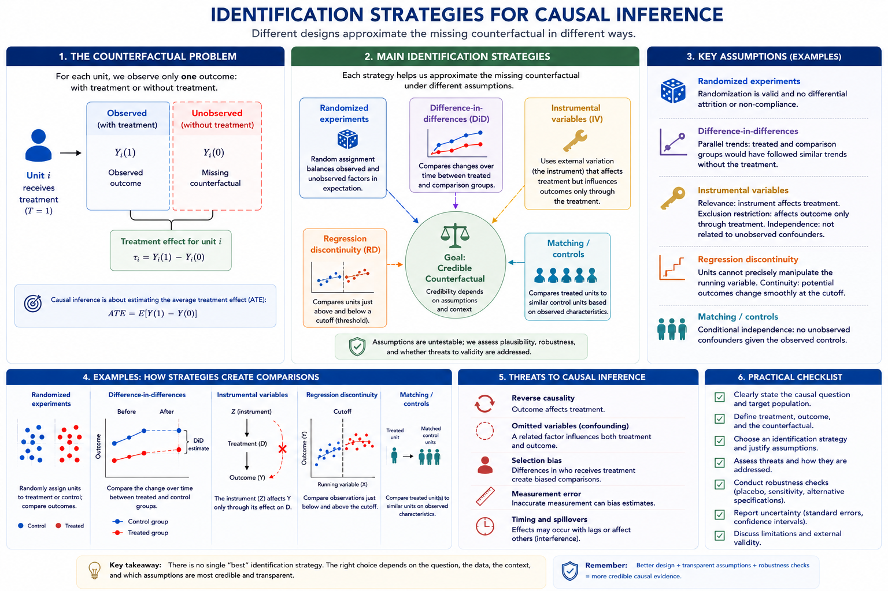

# Causality, Identification, and Policy Evaluation {#causality}

Policymakers and researchers are often interested in causal questions rather than simple associations. Instead of asking whether two variables move together, policy evaluation typically asks whether a policy, program, intervention, or exposure actually caused an outcome to change.

Examples include questions such as:
- Did a training program increase employment?
- Did a carbon tax reduce emissions?
- Did a healthcare intervention improve patient outcomes?
- Did new policing policies reduce crime?

Answering these questions requires more than statistical correlation. The central challenge in causal inference is determining what would have happened in the absence of the intervention. This unobserved alternative is called the *counterfactual*.

Because the same individual, region, or organization cannot simultaneously experience both treatment and non-treatment at the same time, causal inference requires strategies that approximate the missing counterfactual as credibly as possible.

This chapter introduces the logic of counterfactual reasoning, explains major threats to causal interpretation, and outlines common identification strategies used in applied policy evaluation.

## Learning objectives

By the end of this chapter, you should be able to:

- explain why counterfactual reasoning is central to causal inference;
- identify major threats to causal interpretation;
- describe common identification strategies and their assumptions; and
- evaluate the credibility and robustness of causal evidence.

```{r fig-identification, echo=FALSE, fig.cap='Identification strategies for causal inference. Different research designs approximate the missing counterfactual under different assumptions. Credible causal inference depends not only on statistical models, but also on research design, assumptions, and robustness checks.', out.width='100%', fig.align='center'}

```

Figure \@ref(fig:fig-identification) summarizes the central problem of causal inference and several common strategies used to address it. The left panel illustrates the *counterfactual problem*: for each unit, we observe either the treated outcome or the untreated outcome, but never both simultaneously.

The remaining panels show how different identification strategies attempt to approximate the missing counterfactual using different forms of comparison. Some approaches rely on random assignment, while others exploit thresholds, timing differences, external variation, or carefully selected comparison groups.

Importantly, Figure \@ref(fig:fig-identification) also highlights that all identification strategies depend on assumptions. Credibility therefore depends not only on statistical estimation, but also on whether the assumptions are plausible in the policy context being studied.

## Correlation, causation, and the counterfactual problem

Correlation alone does not establish causation. Two variables may move together because one causes the other, because causality operates in the reverse direction, or because both variables are influenced by a third factor.

For example, regions with more hospitals may also have higher mortality rates, not because hospitals increase mortality, but because hospitals are often concentrated in areas with sicker populations. Similarly, education and income are positively associated, but part of this relationship may reflect factors such as family background, ability, or social networks.

The key challenge in causal inference is that we never directly observe the same unit both with and without treatment at the same moment in time. The unobserved outcome without treatment is the missing counterfactual.

Causal inference therefore requires constructing a comparison that approximates what would have happened in the absence of treatment. Different identification strategies attempt to create this comparison in different ways.

Figure \@ref(fig:fig-identification) places the counterfactual problem at the center because all causal designs ultimately attempt to approximate this missing comparison.

## Threats to causal inference

Several common problems can distort causal interpretation.

One important threat is *reverse causality*, where the outcome itself influences treatment. For example, poor health may reduce income, but low income may also worsen health outcomes.

Another major issue is *omitted variable bias* or *confounding*. Confounding occurs when a third factor affects both treatment assignment and outcomes. If important confounding variables are omitted from the analysis, estimated effects may become biased.

*Selection bias* is also common in policy evaluation. Individuals who receive treatment may differ systematically from those who do not. For example, motivated individuals may be more likely to participate in training programs, making simple comparisons misleading.

Measurement error can further distort estimates if variables are measured inaccurately or inconsistently across groups or time periods.

These threats often occur simultaneously in real-world policy settings, which is why research design is central to credible causal analysis.

## Common identification strategies

Different identification strategies attempt to create credible comparisons under different assumptions.

### Randomized experiments

Randomized experiments assign treatment randomly across units. Randomization helps balance both observed and unobserved characteristics between treated and control groups, making the groups comparable on average.

Because treatment assignment is independent of participant characteristics, randomized experiments are often considered the strongest design for internal validity. However, experiments may still face challenges such as attrition, non-compliance, ethical constraints, or limited external validity.

Figure \@ref(fig:fig-identification) illustrates how randomized assignment attempts to create a valid counterfactual through balanced comparison groups.

### Difference-in-differences

Difference-in-differences (DiD) compares changes over time between treated and comparison groups. Instead of comparing levels directly, DiD estimates whether outcomes changed differently after treatment relative to a comparison group.

The key assumption is the *parallel trends assumption*, which states that treated and comparison groups would have followed similar trends in the absence of treatment.

Difference-in-differences designs are widely used in policy evaluation because many real-world policies are implemented at different times or across different jurisdictions.

### Instrumental variables

Instrumental variable (IV) methods use external variation that affects treatment assignment but influences outcomes only through treatment itself.

A valid instrument must satisfy two key conditions:
- it must affect treatment assignment (*relevance*); and
- it must not directly affect the outcome except through treatment (*exclusion restriction*).

Instrumental variables are especially useful when treatment selection is endogenous or affected by unobserved factors.

Figure \@ref(fig:fig-identification) emphasizes that IV methods rely heavily on strong assumptions regarding the instrument’s validity.

### Regression discontinuity

Regression discontinuity (RD) designs exploit thresholds or cutoffs that determine treatment assignment. Units just above and below the threshold are assumed to be comparable except for treatment exposure.

For example, scholarship eligibility based on test scores may create a discontinuity where students near the cutoff are very similar but receive different treatment status.

RD designs often produce highly credible local causal estimates when manipulation around the threshold is limited.

### Matching and controls

Matching methods and regression controls attempt to compare treated units with observationally similar control units.

These methods can improve comparability when rich covariate information is available. However, matching approaches can only account for observed characteristics. Unobserved confounding may still bias results.

Controls should also not be added mechanically. Variables affected by the treatment itself may introduce *post-treatment bias* and distort causal interpretation.

## Robustness, transparency, and policy evaluation

Credible policy evaluation requires more than estimating a statistically significant coefficient. Researchers must clearly define the causal question, justify assumptions, explain the counterfactual, and evaluate robustness.

Figure \@ref(fig:fig-identification) includes a practical evaluation checklist emphasizing transparency, robustness checks, uncertainty reporting, and discussion of limitations.

Robustness checks may include:
- alternative model specifications;
- placebo tests;
- sensitivity analysis;
- alternative control groups;
- or different variable definitions.

Researchers should also discuss implementation details, spillovers, timing issues, and institutional context because these factors may affect whether identification assumptions remain credible.

Importantly, statistical significance alone is not proof of causality. A statistically significant result may still be biased if the identification strategy is weak or assumptions are implausible.

Similarly, causal evidence should always be interpreted together with uncertainty, effect magnitude, external validity, and policy relevance.

## Common pitfalls and key takeaways

Several common mistakes appear repeatedly in applied policy analysis. One is treating correlation as evidence of causation without addressing confounding or selection bias. Another is relying heavily on statistical models while giving insufficient attention to research design and assumptions.

Researchers may also use controls mechanically without considering causal pathways, or selectively report significant findings while omitting robustness checks and non-significant results.

Overall, causal inference depends fundamentally on design rather than statistical modeling alone. A credible counterfactual, transparent assumptions, and careful robustness analysis are central to trustworthy policy evaluation.

Different identification strategies approximate the counterfactual in different ways, and no single method is universally best. The appropriate strategy depends on the policy question, available variation, institutional context, and the plausibility of the required assumptions.