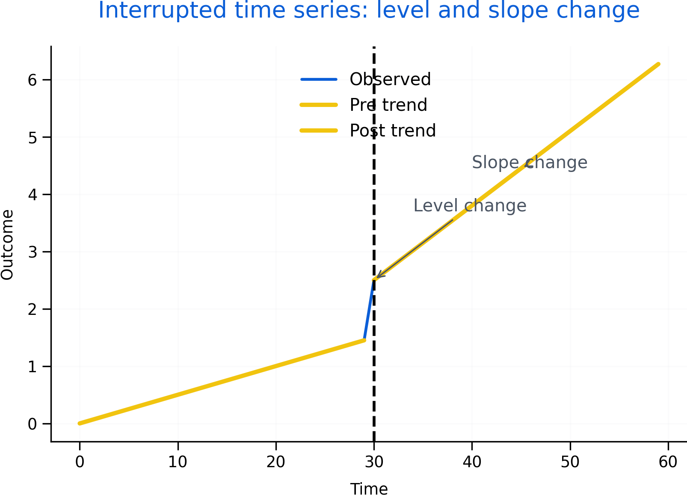

# Interrupted Time Series Analysis (ITSA): Concepts {#itsa}

Interrupted time series analysis evaluates interventions when randomization is not feasible. It uses the pre-intervention trend as a counterfactual and examines whether the post-intervention series shows an immediate level change, a slope change, or both.

Roadmap

We define ITSA, describe segmented regression components, then discuss assumptions and common threats. We close with extensions such as covariates, seasonality, and comparison series.

Learning objectives

- Define ITSA and explain when it is appropriate.
- Interpret level and slope changes as policy effects.
- Identify assumptions and threats such as co-interventions.
- Understand why autocorrelation requires special handling.
- Describe extensions such as controlled ITSA.


```{r fig-itsa-level-slope, echo=FALSE, fig.cap='Interrupted time series showing an intervention point with both a level change and a slope change. These components map directly to segmented regression parameters.', out.width='95%'}

```


Figure \@ref(fig:fig-itsa-level-slope) distinguishes two common intervention effects. Some policies cause immediate discontinuities; others change trends over time.

The code below shows the standard segmented‑regression structure behind ITSA: a baseline trend, an intervention indicator (level change), and a post‑intervention trend term (slope change).

```{r itsa-segmented-regression-template, eval=FALSE, echo=TRUE}
# Template: segmented regression for ITSA
# t0 = the time index where the intervention starts (e.g., month 25)

# Example data (simulated) — replace this block with your real dataset
set.seed(1)
n <- 60
t0 <- 31  # intervention starts at time point 31 (adjust as needed)

df <- data.frame(
  time = 1:n
)

# Create a simple outcome with a baseline trend + level change + slope change
df$intervention <- ifelse(df$time >= t0, 1, 0)
df$post_time <- pmax(0, df$time - t0 + 1)

df$outcome <- 10 + 0.10*df$time + 2*df$intervention + 0.05*df$post_time + rnorm(n, 0, 0.5)

# Fit segmented regression
model_itsa <- lm(outcome ~ time + intervention + post_time, data = df)
summary(model_itsa)

# Interpretation:
# - intervention = immediate level change at t0
# - post_time    = change in slope after t0
```


## Segmented regression interpretation

A basic ITSA model estimates baseline trend, an immediate shift at the intervention, and a change in slope afterward. Interpretation depends on implementation timing and theory of change.

## Assumptions and threats

The central assumption is that the pre-intervention trend would have continued absent the intervention. Threats include co-interventions, changes in measurement, seasonality, and regression to the mean.

Autocorrelation is common in time series and can invalidate naive standard errors.

## Extensions

Extensions include covariates, interaction terms for heterogeneity, seasonality controls, time-series error structures, and comparison series.

Common pitfalls

- Declaring a causal effect without checking co-interventions.
- Using too few pre-intervention points to assess trend.
- Ignoring autocorrelation and seasonality.

Key takeaways

- ITSA is powerful when trends are stable and intervention timing is clear.
- Diagnostics and robustness checks are essential for credible claims.
