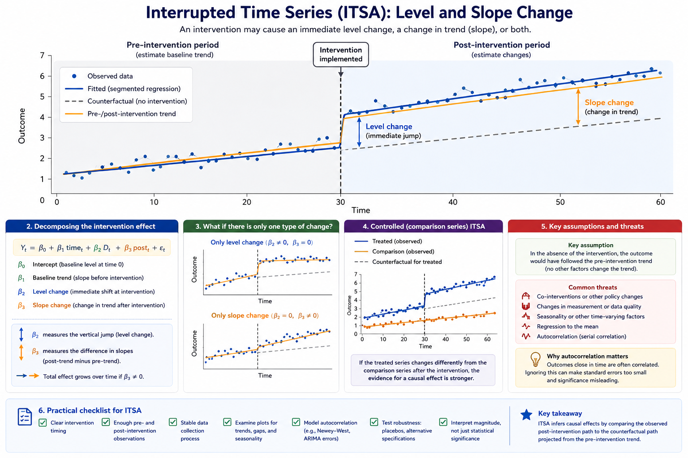

# Interrupted Time Series Analysis (ITSA): Concepts {#itsa}

Many important policies and interventions cannot be evaluated using randomized experiments. Governments rarely randomize tax changes, healthcare reforms, environmental regulations, or public safety interventions across populations. In these situations, researchers often rely on observational designs that attempt to estimate what would have happened in the absence of the intervention.

Interrupted time series analysis (ITSA) is one of the strongest quasi-experimental approaches available when interventions occur at a clearly identifiable point in time and repeated observations are available before and after implementation.

The central idea behind ITSA is straightforward: the pre-intervention trend serves as the estimated counterfactual. Researchers then evaluate whether the observed post-intervention trajectory departs from that projected trend through an immediate level change, a slope change, or both.

This chapter introduces the logic of interrupted time series analysis, explains segmented regression interpretation, discusses major assumptions and threats, and concludes with extensions commonly used in applied policy evaluation.

## Learning objectives

By the end of this chapter, you should be able to:

- explain the logic of interrupted time series analysis and when it is appropriate;
- interpret level changes and slope changes in segmented regression models;
- identify important assumptions and threats to validity;
- understand why autocorrelation and seasonality require special handling; and
- describe extensions such as controlled ITSA and seasonal adjustment.

```{r fig-itsa-level-slope, echo=FALSE, fig.cap='Interrupted time series showing an intervention point, observed post-intervention outcomes, and the projected counterfactual trend. The figure illustrates both an immediate level change and a post-intervention slope change, which correspond directly to segmented regression parameters.', out.width='100%', fig.align='center'}

```

Figure \@ref(fig:fig-itsa-level-slope) illustrates the core logic of interrupted time series analysis. The dashed vertical line marks the intervention point. The dashed counterfactual continuation represents the trajectory that would have been expected if the intervention had not occurred, assuming the pre-intervention trend continued unchanged.

The observed post-intervention series deviates from this projected trend in two important ways. First, there is an immediate jump at the intervention point, known as a *level change*. Second, the long-run trajectory after intervention differs from the original slope, creating a *slope change*. Some policies produce abrupt discontinuities, while others gradually alter the direction or rate of change over time.

Unlike simple before-after comparisons, ITSA explicitly accounts for pre-existing trends. This is one of the main reasons interrupted time series designs are often more credible than simple pre/post analyses.

## Counterfactual trends and segmented regression

The strength of ITSA comes from its use of the historical trend as a counterfactual benchmark. Rather than asking only whether outcomes changed after intervention, ITSA asks whether outcomes changed *more than would have been expected based on prior trajectory*.

Segmented regression is commonly used to estimate these effects statistically. A basic segmented regression model includes:
- a baseline trend before intervention;
- an indicator for the intervention period that estimates the immediate level change; and
- a post-intervention time trend that estimates slope change after intervention.

Figure \@ref(fig:fig-itsa-level-slope) maps these concepts visually onto the segmented regression framework. The immediate vertical jump corresponds to the intervention indicator, while the divergence between the post-intervention trend and the projected counterfactual reflects the slope-change parameter.

The following template illustrates a standard ITSA workflow using segmented regression.

```{r itsa-segmented-regression-template, eval=FALSE, echo=TRUE}
# Template: segmented regression for ITSA
# t0 = the time index where the intervention starts

set.seed(1)

n <- 60
t0 <- 31

df <- data.frame(
  time = 1:n
)

# Intervention indicator
df$intervention <- ifelse(df$time >= t0, 1, 0)

# Time after intervention
df$post_time <- pmax(0, df$time - t0 + 1)

# Simulated outcome:
# baseline trend + level change + slope change
df$outcome <- 10 +
  0.10 * df$time +
  2 * df$intervention +
  0.05 * df$post_time +
  rnorm(n, 0, 0.5)

# Segmented regression model
model_itsa <- lm(
  outcome ~ time + intervention + post_time,
  data = df
)

summary(model_itsa)

# Interpretation:
# - intervention = immediate level change
# - post_time    = slope change after intervention
```

In practice, interpretation should always be guided by the intervention’s theory of change. Some interventions are expected to create immediate discontinuities, while others may influence outcomes gradually over time.

For example, a media campaign may have delayed behavioural effects, whereas a tax increase may alter prices immediately.

## Assumptions and threats to validity

The most important assumption in ITSA is that the pre-intervention trend would have continued in the absence of intervention. In other words, the projected counterfactual trend must be a reasonable approximation of what would have happened without policy change.

Several threats can weaken this assumption.

One major threat is the presence of *co-interventions*, where another policy or event occurs around the same time as the intervention. If multiple changes occur simultaneously, separating their effects becomes difficult.

Changes in data collection, reporting systems, or measurement definitions may also create artificial discontinuities that resemble intervention effects.

Seasonality is another important issue. Many economic, environmental, and health outcomes fluctuate systematically across months, quarters, or seasons. Ignoring these recurring patterns may bias intervention estimates.

Regression to the mean can also create misleading patterns when interventions are implemented after unusually high or low observations.

Importantly, interrupted time series data frequently exhibit *autocorrelation*, meaning nearby observations remain statistically dependent across time. Ignoring autocorrelation may produce standard errors that are too small and statistical significance that appears stronger than it truly is.

For this reason, ITSA often requires specialized error structures or time-series corrections beyond ordinary least squares assumptions.

Reliable ITSA also requires sufficient observations before and after intervention. Too few pre-intervention observations make it difficult to establish whether the baseline trend is stable, while too few post-intervention observations may obscure gradual slope changes.

## Extensions and practical applications

Interrupted time series analysis can be extended in several important ways.

Researchers may include additional covariates to adjust for changing contextual factors. Seasonal terms can account for repeating cyclical patterns, while autoregressive error structures can address autocorrelation directly.

One particularly important extension is *controlled interrupted time series analysis*, where a comparison series unaffected by the intervention is included alongside the treated series. Comparison groups help distinguish intervention effects from broader system-wide changes occurring at the same time.

Interaction terms may also be used to evaluate heterogeneous effects across regions, demographic groups, or institutions.

In applied policy analysis, ITSA is frequently used in:
- public health evaluation,
- pharmaceutical policy,
- environmental regulation,
- healthcare utilization studies,
- transportation safety,
- and education reform.

Because many large-scale policies are implemented at clearly identifiable dates, interrupted time series designs are often highly practical in real-world evaluation settings.

## Common pitfalls and key takeaways

Several recurring mistakes can weaken interrupted time series analysis. One common problem is declaring causal effects without evaluating whether other simultaneous events may explain the observed change. Another is relying on very short pre-intervention periods that provide little evidence regarding baseline stability.

Researchers may also ignore autocorrelation, seasonality, or structural breaks, leading to overly confident statistical inference.

Importantly, ITSA should not be interpreted as a purely mechanical statistical procedure. Credible interpretation depends on institutional knowledge, policy timing, implementation details, and the plausibility of the counterfactual trend assumption.

Overall, interrupted time series analysis is one of the most powerful quasi-experimental tools available when interventions occur at identifiable points in time and stable pre-intervention trends exist. By explicitly modeling counterfactual trajectories, ITSA provides a structured framework for evaluating policy effects in settings where randomization is impractical or impossible.