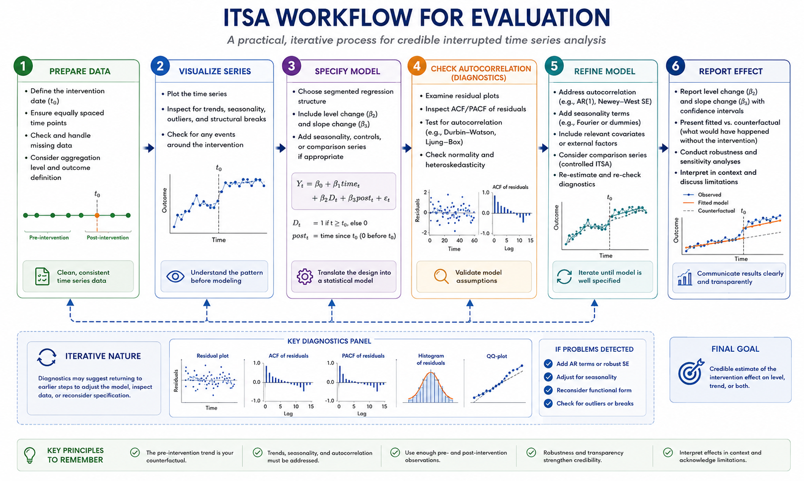

# Interrupted Time Series Analysis (ITSA): Worked Example {#itsa-applied}

Interrupted time series analysis becomes much easier to understand when viewed as a structured workflow rather than only a statistical model. In practice, researchers move through a sequence of stages that include data preparation, visualization, model specification, diagnostics, refinement, and interpretation. The process is iterative rather than purely linear because problems identified during diagnostics often require revisiting earlier modeling decisions.

This chapter presents a practical workflow for conducting ITSA in R. The emphasis is not only on fitting a segmented regression model, but also on understanding why each step matters for credible policy evaluation.

```{r fig-itsa-workflow, echo=FALSE, fig.cap='Practical ITSA workflow for evaluation. Interrupted time series analysis is an iterative process involving data preparation, visualization, model specification, diagnostics, refinement, and interpretation.', out.width='100%', fig.align='center'}

```

Figure \@ref(fig:fig-itsa-workflow) summarizes the overall logic of an applied ITSA workflow. The analysis begins with preparing a clean and consistent time series, followed by visualization to identify trends, seasonality, outliers, and possible structural breaks. Researchers then specify an initial segmented regression model, evaluate diagnostics such as autocorrelation, refine the model if necessary, and finally interpret and report the estimated intervention effects.

A key lesson from the workflow is that ITSA is iterative. Diagnostics may reveal residual autocorrelation, seasonality, or model misspecification, requiring researchers to return to earlier stages and adjust the specification before drawing conclusions.

## Preparing and visualizing the time series

The first stage in ITSA is preparing the dataset. Time points should be equally spaced and aligned consistently across the study period. Researchers must define the intervention date carefully and determine whether the intervention effect is expected to occur immediately or gradually over time.

Data preparation also involves checking for missing observations, unusual spikes, coding inconsistencies, and changes in measurement definitions. Even small inconsistencies in reporting systems can create artificial discontinuities that resemble intervention effects.

After cleaning the data, visualization becomes the most important diagnostic step. Plotting the series helps identify:
- long-run trends,
- recurring seasonal patterns,
- structural breaks,
- outliers,
- and unusual volatility.

Figure \@ref(fig:fig-itsa-workflow) highlights visualization early in the workflow because understanding the data structure should guide model specification. Researchers should not specify segmented regression models mechanically before understanding how the series behaves.

In many applications, plotting the raw series immediately reveals whether additional modeling components are needed, such as seasonality terms, autoregressive corrections, or comparison groups.

## Specifying the segmented regression model

Once the time series has been explored visually, the next step is specifying a segmented regression model. A basic ITSA model typically includes:
- a baseline time trend,
- an intervention indicator representing the immediate level change,
- and a post-intervention trend term representing slope change after the intervention.

The model attempts to estimate how the observed post-intervention trajectory differs from the projected counterfactual continuation of the pre-intervention trend.

The following code illustrates a simplified segmented regression workflow in R.

```{r itsa-worked-template, eval=FALSE, echo=TRUE}
# Example ITSA workflow in R

set.seed(1)

# Create time index
n <- 60
t0 <- 31

df <- data.frame(
  time = 1:n
)

# Intervention indicator
df$intervention <- ifelse(df$time >= t0, 1, 0)

# Time since intervention
df$post_time <- pmax(0, df$time - t0 + 1)

# Simulated outcome with:
# - baseline trend
# - level change
# - slope change
df$outcome <- 10 +
  0.10 * df$time +
  2 * df$intervention +
  0.05 * df$post_time +
  rnorm(n, 0, 0.5)

# Fit segmented regression
model_itsa <- lm(
  outcome ~ time + intervention + post_time,
  data = df
)

summary(model_itsa)
```

In this model, the intervention coefficient estimates the immediate level change occurring at the intervention point, while the post-intervention trend coefficient estimates whether the slope changed after implementation.

Importantly, interpretation should always be connected to substantive theory and policy context. Some interventions are expected to create abrupt discontinuities, while others influence outcomes gradually over time.

## Diagnostics and model refinement

A segmented regression model should never be interpreted without diagnostic evaluation. Time-series data often violate ordinary least squares assumptions because nearby observations remain correlated across time.

Figure \@ref(fig:fig-itsa-workflow) emphasizes diagnostics as a central stage rather than a final afterthought. Researchers should examine:
- residual plots,
- autocorrelation functions (ACF),
- partial autocorrelation functions (PACF),
- seasonality,
- and potential structural breaks.

Residual autocorrelation is especially important because it can produce underestimated standard errors and overly optimistic significance tests.

If diagnostics reveal problems, the model may require refinement. Common adjustments include:
- adding autoregressive terms,
- introducing seasonal indicators,
- incorporating comparison series,
- transforming variables,
- or reconsidering the intervention timing.

This iterative process is one of the defining features of high-quality ITSA work. Good modeling practice involves repeatedly evaluating whether the specification adequately captures the structure visible in the data.

Researchers should also evaluate whether enough observations exist before and after the intervention. Very short pre-intervention periods make it difficult to establish stable baseline trends, while short post-intervention periods may fail to capture gradual effects.

## Reporting and interpreting intervention effects

The final stage of ITSA involves communicating results clearly and transparently. Statistical significance alone is insufficient. Researchers should report:
- estimated level and slope changes,
- confidence intervals,
- model assumptions,
- diagnostic findings,
- and robustness checks.

Figure \@ref(fig:fig-itsa-workflow) ends with reporting because interpretation is ultimately the goal of the analysis. Intervention effects should always be discussed in practical rather than purely statistical terms.

For example, a slope change may indicate that a policy gradually reduced hospital admissions over several months, while a level change may reflect an immediate shift in prescribing behaviour after regulation.

Importantly, ITSA estimates should always be interpreted cautiously in light of possible co-interventions, changing contextual conditions, and data limitations.

## Common pitfalls and practical lessons

Several recurring mistakes weaken interrupted time series analyses. One common problem is treating the intervention date as unquestionably causal without examining whether other events occurred simultaneously. Another is ignoring seasonality or autocorrelation, leading to misleading statistical inference.

Researchers may also overfit the model by adding unnecessary complexity without theoretical justification. Conversely, overly simple models may fail to capture important structure visible in the series.

A strong ITSA analysis combines statistical modeling with contextual understanding of implementation timing, institutional processes, and data quality.

Overall, interrupted time series analysis is most credible when researchers treat it as a full evaluation workflow rather than a single regression equation. Careful visualization, diagnostics, refinement, and transparent reporting are essential for producing reliable and interpretable policy evidence.