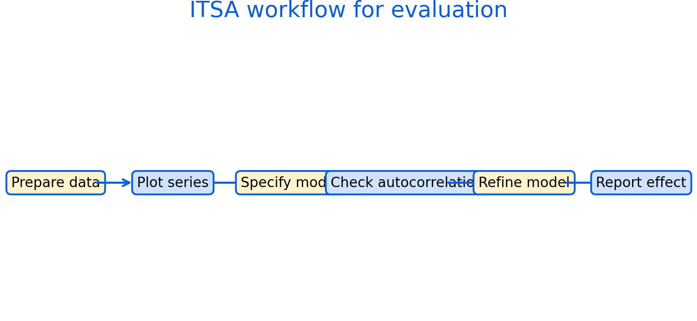

# Interrupted Time Series Analysis (ITSA): Worked Workflow {#itsa-applied}

This chapter summarizes a practical workflow for implementing ITSA. The goal is to structure applied work so that assumptions are checked, diagnostics are reported, and results are communicated clearly.

Roadmap

We outline a step-by-step process from data preparation to model refinement and reporting. The workflow is compatible with regression-based ITSA and time-series error models.

Learning objectives

- Prepare and structure time-series data for ITSA.
- Use plots to check trends, outliers, and seasonality.
- Specify a segmented regression model and interpret parameters.
- Diagnose autocorrelation and adjust inference.
- Report results with uncertainty and sensitivity checks.


```{r fig-itsa-workflow, echo=FALSE, fig.cap='Practical ITSA workflow: prepare data, visualize, specify model, check autocorrelation, refine, and report effects with uncertainty and sensitivity checks.', out.width='95%'}

```


Figure \@ref(fig:fig-itsa-workflow) is a checklist for applied work. It helps ensure that evaluation is transparent and reproducible.

## Reporting recommendations

A strong ITSA report includes:

- clear definition of the intervention and timing
- justification for pre and post windows
- plots of the outcome with intervention markers
- model specification with level and slope terms
- autocorrelation diagnostics and corrected inference
- sensitivity analysis (alternative windows, functional forms, seasonality)

Common pitfalls

- Reporting a single model with no sensitivity checks.
- Omitting diagnostic evidence for autocorrelation.
- Over-interpreting short post-intervention windows.

Key takeaways

- A transparent workflow improves credibility.
- Sensitivity checks are part of good evaluation practice.
